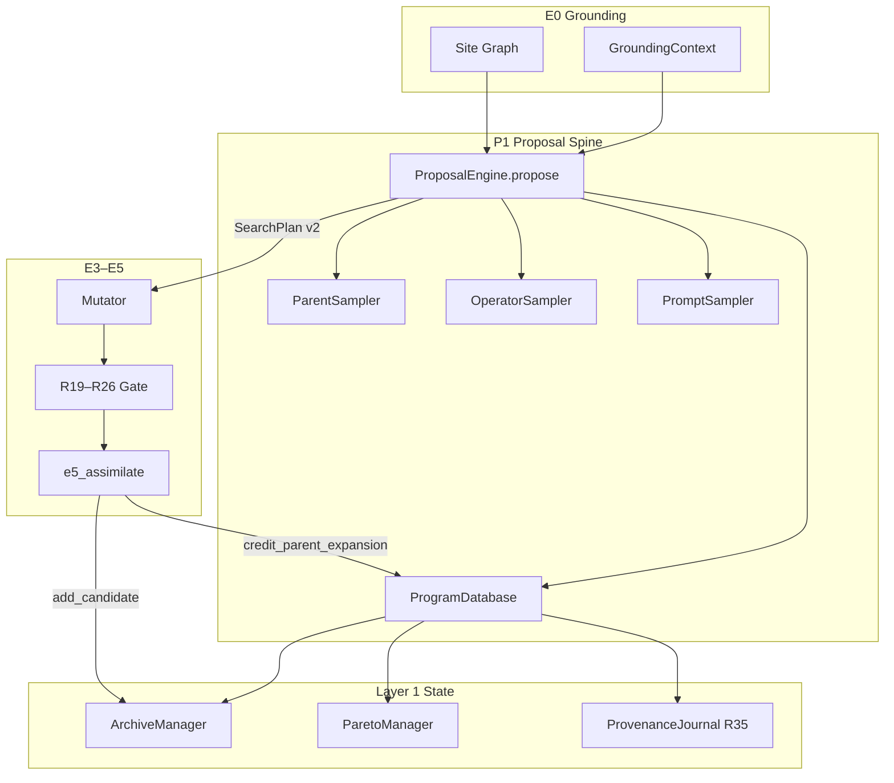
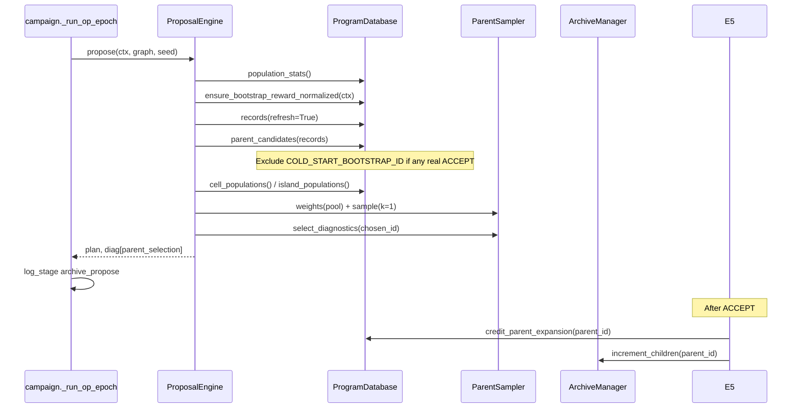
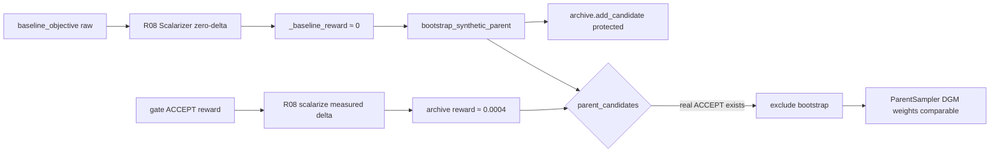

# FIX_1 — DGM Parent Selection & Program Database

---

## 1. Document Control

| Field | Value |
|-------|-------|
| **Version** | 1.0.0 |
| **Date** | 2026-06-17 |
| **Owner** | Daedalus P1 repair charter (Agentic_campaign) |
| **Scope** | Phase P1 — archive-driven proposal spine: `search/program_database.py`, `search/parent_sampler.py`, `search/proposal_engine.py`, campaign stdout/journal wiring for parent selection, population telemetry |
| **Primary gap IDs** | P1-001, P1-004, RG-B003, RG-B005 |
| **Secondary awareness** | P1-002 (single-site deferred), P1-006 (async off), P1-008 (behavioral feature map — not in scope) |
| **Excludes** | Gating E4 cascade (Wave 4–7 gating team), FIX_2 mutation context, FIX_3 meta RSI, target graduation (X-001/RG-B002), REFACTOR IDLE_STALL (RG-A001) |
| **Verification gate** | `python verification/run_all_daedalus_verifications.py` exit 0 from `daedalus/` |
| **Live acceptance** | `verification/live/run_all_generated_campaigns.py --target simple_rsi_strategy` with archive parent selection logs sane after first ACCEPT |
| **Evidence sources** | `daedalus/MISSING.JSON` (phase_1_proposal_search), `daedalus/RUN_GAPS.JSON` (run_gaps_simple_rsi_002), `verification/live/run_gaps_campaign_002.log` |

### 1.1 Honesty Rule

Verification scripts passing proves wiring and unit-level DGM math — **not** that live campaigns sampled real archive parents before this charter lands. RUN_GAPS run_002 demonstrates parent selection theater despite green `verify_proposal_engine.py` on synthetic fixtures.

### 1.2 Single-Writer Discipline

Each FIX_1 agent owns exclusive write access to its file set. Cross-agent edits require sequential handoff: A → B → C → D → E. No agent modifies `orchestrator/epochs/e3_e4_verify.py`, gate tools, or gating registry modules.

---

## 2. Executive Summary

Daedalus P1 replaced the legacy UCB site×operator grid with an AlphaEvolve-style program database and DGM parent selection (`DAEDALUS_SEARCH_MODE=archive`). The code path is real: `ProposalEngine.propose()` samples parents via `ParentSampler`, operators via `OperatorSampler`, assembles prompts via `PromptSampler`, and emits `SearchPlan` v2. DGM weight math (`sigmoid(perf) × 1/(1+children)`) is implemented and unit-tested.

**Production behavior is broken.** Live campaign `run_gaps_simple_rsi_002` shows the synthetic cold-start bootstrap parent (`cold_start::baseline_champion`) dominated parent selection because its stored reward (~2.313) was on a different scale than gate ACCEPT rewards (~0.00037). After the first real ACCEPT (`cand_cbf78ee5a9`), epoch 1 round 0 reverted to the bootstrap parent at `pop=2`. Population counters reported `pop=2` after a single ACCEPT, confusing cold-start diagnostics.

FIX_1 repairs four intertwined failures:

1. **P1-001 / RG-B003** — Bootstrap reward must use the same R08 scalarizer as gate ACCEPTs; protected bootstrap must leave the parent pool once any real ACCEPT exists; stale archives must be normalized on propose.
2. **P1-004 / RG-B005** — `population_stats()` must be the single authoritative population definition (real ACCEPT count, not island member count or bootstrap-inclusive totals).
3. **Campaign observability** — `archive_propose` stdout must log `parent_selection.chosen_probability`, pool size, bootstrap exclusion flag, and comparable reward diagnostics.
4. **Verification + live acceptance** — Extend `verify_proposal_engine.py` with fixtures mirroring run_002 reward scales; add integration test proving epoch-1 parent is a real `cand_*` after first ACCEPT.

Five agents (FIX_1-A through FIX_1-E) implement in dependency order. Each agent exits 0 on the full Daedalus verification suite before handoff.

---

## 3. Institutional References

### 3.1 Darwin Gödel Machine — arXiv:2505.22954 §C.2

DGM maintains an archive of **all** agents including stepping stones. Parent selection uses:

```
s_i = sigmoid(λ · (perf_i − α_0))
h_i = 1 / (1 + children_i)
w_i = s_i · h_i
P(parent = i) = w_i / Σ_j w_j
```

Performance scores must be **comparable** across archive entries. Daedalus maps gate rewards through R08 tanh scalarization; bootstrap synthetic parents must use the same scale or DGM weights become theater.

### 3.2 AlphaEvolve — arXiv:2506.13131 §2.5

Program database with MAP-Elites cells and islands. Prompt sampler receives parent program, multi-objective scores, inspirations from other niches, and mutation history. Daedalus `ProgramDatabase` wraps `ArchiveManager` + `ParetoManager`; `sample_inspirations()` uses embedding max-min distance (Voyager-style retrieval).

### 3.3 FunSearch Island Model (Nature 2023)

Semi-independent island populations with periodic migration. Daedalus `ArchiveManager` implements `ISLAND_COUNT` islands, `MIGRATION_INTERVAL`, and quarantine on migrant elites. `parent_sampler.py` adds `PARENT_ISLAND_BALANCE` under-populated-island pressure.

### 3.4 QuantEvolve — arXiv:2510.18569 §4 (P1-008 awareness)

Behavioral feature-map archive (risk, frequency, return descriptors). **Not in FIX_1 scope** — current niche cells are file-module clusters (`cluster::data_loader.py`) plus optional behavioral suffix via `behavioral_descriptor()`. P1-008 deferred to FIX_5 / embeddings track.

### 3.5 Optional Open Source

| Project | Relevance to FIX_1 |
|---------|-------------------|
| **OpenEvolve** | Inspiration crossover + evaluator pool pattern; mirrors Daedalus async eval pool (P1-006, disabled) |
| **jennyzzt/dgm** | Reference DGM parent formula and archive-of-all-agents semantics |
| **pwb-alphaevolve** | MAP-Elites program DB + prompt assembly at smaller scale |

---

## 4. What's Wrong — Gap Inventory with Live Evidence

### 4.1 P1-001 — Cold-Start Bootstrap Reward Scale Breaks DGM Parent Selection

| Attribute | Detail |
|-----------|--------|
| **Severity** | Critical |
| **Location** | `search/program_database.py::_baseline_reward`, `bootstrap_synthetic_parent`, `parent_candidates`; `search/parent_sampler.py::ParentSampler.sample` |
| **Reference** | DGM §C.2 — perf scores must be comparable |
| **Root cause (historical)** | `_baseline_reward` returned `mean(baseline_objective)` (~2–6) without R08 tanh normalization used at gate |
| **Code status** | Partial fix present: `_baseline_reward` now calls `Scalarizer().scalarize()` with zero delta (lines 41–60); `ensure_bootstrap_reward_normalized()` patches stale archives (lines 169–181) |
| **Live gap** | run_002 archive.json still held `cold_start reward=2.313` during campaign; normalization either not invoked at E0 or predated fix |

**Live evidence (RUN_GAPS RG-B003):**

```
run_002 epoch 0 rounds 0–4: parent=cold_start::baseline_champion (5/6 rounds)
run_002 epoch 0 round 5:    parent=cand_cbf78ee5a9 (only once)
run_002 epoch 1 round 0:    parent=cold_start::baseline_champion again at pop=2
archive.json: cold_start reward=2.313, cand_* reward≈0.00037
phase_journal: "parent_sampler reverted to cold_start::baseline_champion at pop=2"
```

**Impact:** Open-ended DGM parent selection collapses to perpetual baseline bootstrap. Inspirations, lineage, and P2 mutation context remain empty (RG-C003 downstream).

### 4.2 P1-004 — Population Metric Inconsistent

| Attribute | Detail |
|-----------|--------|
| **Severity** | Medium |
| **Location** | `search/program_database.py::population_stats` vs `state/archive_manager.py::island_populations` |
| **Live evidence (RG-B005)** | `archive_propose pop=2` after first ACCEPT; `pop=2` persisted with 1 accept + 1 discard in early rounds |
| **Root cause** | Operators interpreted `pop` as island member count or bootstrap-inclusive archive size; `is_cold` uses `COLD_START_MIN_POPULATION=4` against real ACCEPT count |
| **Code status** | `population_stats()` counts `_is_real_accept()` only (lines 295–318); campaign log still ambiguous |

**Impact:** Misleading cold-start flag (`cold=True` at pop=2 with 1 ACCEPT); curriculum and killswitch may receive wrong population signal.

### 4.3 RG-B003 — DGM Parent Selection Dominated by Protected Bootstrap (Live Journal)

Consolidates P1-001 with campaign-level evidence from `RUN_GAPS.JSON`:

| Timestamp | Event | Parent | pop |
|-----------|-------|--------|-----|
| 2026-06-15T21:05:54Z | epoch 0 round 3 ACCEPT | — | — |
| 2026-06-15T21:14:00Z | epoch 0 round 4 propose | cold_start | 2 |
| 2026-06-15T21:28:09Z | epoch 0 round 5 propose | cand_cbf78ee5a9 | 2 |
| 2026-06-15T21:28:38Z | epoch 1 round 0 propose | cold_start | 2 |

Log excerpt (`run_gaps_campaign_002.log` line 294):

```
[daedalus:21:28:38] archive_propose — parent=cold_start::baseline_champion op=REFACTOR cold=True pop=2
```

Required: after first real ACCEPT, **≥80%** of subsequent proposes in same epoch sample `cand_*` parents (excluding bootstrap from pool).

### 4.4 RG-B005 — Archive Population Counter Lags Accepts

| Evidence | Detail |
|----------|--------|
| run_001 | `pop=2` after first ACCEPT when journal had 1 ACCEPT |
| run_002 | `pop=2` at epoch 0 round 3 after `cand_cbf78ee5a9` ACCEPT |
| Confusion | Bootstrap counted in archive_size but must not inflate population |

**Required:** Campaign stdout distinguishes `population` (real ACCEPTs), `archive_size` (all entries), `n_accepted`, and `bootstrap_excluded` boolean from `proposal_engine` diag.

### 4.5 P1 Gap Awareness (Out of FIX_1 Scope)

| ID | Title | Why excluded |
|----|-------|--------------|
| P1-002 | Single-site proposal per round | Deferred pending P1-006 async eval; documented in `_resolve_site` comment |
| P1-003 | Target/site misaligned with RSI objective | FIX_2 / target bootstrap charter |
| P1-005 | Legacy e1_e2_search fake gnn_mu | Only when `DAEDALUS_SEARCH_MODE=legacy` |
| P1-006 | Async eval disabled | Enable after FIX_1 stable; RG-B006 |
| P1-007 | LLM-target proposal parity | Separate target class |
| P1-008 | QuantEvolve behavioral feature map | Not implemented; future MAP-Elites on trading KPIs |

---

## 5. Architecture and Data Flow

### 5.1 Component Diagram



### 5.2 Parent Selection Data Flow (DGM)



### 5.3 Reward Scale Alignment (P1-001 Fix Path)



### 5.4 Key Files and Responsibilities

| File | Role |
|------|------|
| `search/program_database.py` | Read/sample API; bootstrap seed; parent pool; population_stats; DGM children credit |
| `search/parent_sampler.py` | DGM weight formula; categorical sample; select_diagnostics |
| `search/proposal_engine.py` | Orchestrates propose(); emits diag for campaign |
| `state/archive_manager.py` | Persistent archive.json; cell/island populations; update_reward |
| `orchestrator/campaign.py` | `archive_propose` log_stage lines 200–206 |
| `orchestrator/epochs/e5_assimilate.py` | `credit_parent_expansion` on ACCEPT |
| `verification/verify_proposal_engine.py` | P1 wiring + P1-001/P1-004 fixtures |

---

## 6. Five-Agent Segmentation

Agents run sequentially: **A → B → C → D → E**. Each exits 0 on `python verification/run_all_daedalus_verifications.py` before the next begins.

---

### FIX_1-A — Bootstrap Reward Normalization & Parent Pool Hygiene

#### Agent Charter Name

`FIX_1-A: Bootstrap R08 Normalization & Parent Pool Exclusion`

#### Owned Files (Exclusive Write)

- `daedalus/search/program_database.py`
- `daedalus/config/daedalus_config.py` (only `COLD_START_*` constants if adjustment needed)

#### Forbidden Overlaps

- Do not edit `parent_sampler.py` (FIX_1-B)
- Do not edit `proposal_engine.py` except if A needs a one-line call already present (prefer B/D)
- Do not edit `campaign.py`, `verify_proposal_engine.py`, or `archive_manager.py`

#### Exact Problem Statement

Bootstrap synthetic parent reward must be R08-comparable to gate ACCEPT rewards. Stale archives from pre-fix campaigns store `reward≈2.313` for `cold_start::baseline_champion`, causing DGM sigmoid to always favor bootstrap over real accepts at `reward≈0.00037`. Protected bootstrap must be excluded from `parent_candidates()` once any real ACCEPT exists in the archive.

#### Implementation Steps

1. **Verify `_baseline_reward()` (program_database.py:41–60)** uses `Scalarizer().scalarize()` with zero delta and returns tanh-scaled reward near 0 for typical baselines. If `G` tensor missing, return `0.0` (already implemented).
2. **Harden `bootstrap_synthetic_parent()` (lines 63–78)** — ensure `reward=_baseline_reward(ctx)` never falls back to raw objective mean. Add assertion in debug: `abs(reward) < 0.15` when baseline objectives are finite.
3. **Audit `parent_candidates()` (lines 161–167)** — confirm exclusion logic:
   ```python
   if any(_is_real_accept(r) for r in pool):
       return [r for r in pool if r.candidate_id != COLD_START_BOOTSTRAP_ID]
   ```
4. **Strengthen `ensure_bootstrap_reward_normalized()` (lines 169–181)** — call on every `propose()` (already wired proposal_engine.py:75). Add E0 grounding hook: invoke from `orchestrator/epochs/e0_grounding.py` after baseline eval so first OP round never reads stale reward.
5. **Add `migrate_stale_bootstrap_reward(ctx)` helper** — if stored bootstrap reward differs from normalized by >0.01, log one-shot warning via `tools.lifecycle.stage_heartbeat.log_stage("bootstrap_reward_migrated", ...)`.
6. **Document `_is_real_accept()` (lines 34–38)** — ACCEPT verdict AND `candidate_id != COLD_START_BOOTSTRAP_ID`. Stepping stones (`ARCHIVE_STEPPING_STONE`) are not real accepts for population count.

#### Unit Tests to Add/Modify

| Test | Location | Assertion |
|------|----------|-----------|
| Bootstrap reward near zero | `verify_proposal_engine.py::_verify_bootstrap_parent_selection` | `abs(boot.reward) < 0.05` |
| Stale archive migration | New in FIX_1-E or extend `_verify_bootstrap_parent_selection` | Seed reward=2.313 → after `ensure_bootstrap_reward_normalized` → reward < 0.1 |
| Pool exclusion | Existing lines 296–297 | Bootstrap absent from pool after ACCEPT |
| Weight ordering | Existing lines 306–309 | Underexplored accept beats overexplored bootstrap at comparable rewards |

#### Done-When Criteria

- [ ] `_baseline_reward` never returns raw objective mean
- [ ] `ensure_bootstrap_reward_normalized` patches archive.json when stale reward detected
- [ ] `parent_candidates()` returns only real accepts when ≥1 ACCEPT exists
- [ ] E0 grounding invokes bootstrap normalization before first OP round
- [ ] `verify_proposal_engine.py` P1-001 checks pass (agent runs full suite exit 0)

---

### FIX_1-B — Parent Sampler Weights, Diagnostics Logging, Campaign Stdout

#### Agent Charter Name

`FIX_1-B: DGM Weight Diagnostics & Campaign archive_propose Logging`

#### Owned Files (Exclusive Write)

- `daedalus/search/parent_sampler.py`
- `daedalus/orchestrator/campaign.py` (only `log_stage("archive_propose", ...)` blocks ~lines 200–206 and ~296–298)

#### Forbidden Overlaps

- Do not change DGM formula constants without documenting in MISSING.JSON
- Do not edit `program_database.py` (FIX_1-A)
- Do not edit `proposal_engine.py` diag assembly (FIX_1-D) except coordinate field names

#### Exact Problem Statement

Campaign stdout logs `weight=` (unnormalized chosen_weight) but not `chosen_probability`, entropy, or bootstrap exclusion. Operators cannot audit DGM parent selection during live runs. Async path (`_run_op_rounds_async`) logs fewer fields than sequential path.

#### Implementation Steps

1. **Extend `select_diagnostics()` (parent_sampler.py:110–122)** — add fields:
   - `chosen_reward`: float
   - `weight_rank`: int (1 = highest weight in pool)
   - `pool_ids`: list[str] (cap at 8 for log brevity)
2. **Add `weight_breakdown(record) -> dict`** — expose `s_i`, `h_i`, `niche`, `island`, `w_i` for chosen parent (debug/journal only).
3. **Update sequential `log_stage` (campaign.py:200–206)**:
   ```python
   ps = sdiag.get("parent_selection") or {}
   log_stage("archive_propose",
       f"parent={sdiag.get('parent_id')} "
       f"p={ps.get('chosen_probability')} "
       f"weight={ps.get('chosen_weight')} "
       f"pool={sdiag.get('parent_pool_size')} "
       f"boot_excl={sdiag.get('bootstrap_excluded')} "
       f"op={sdiag.get('operator')} "
       f"cold={sdiag.get('cold_start')} "
       f"pop={sdiag.get('population_stats', {}).get('population')} "
       f"arch={sdiag.get('population_stats', {}).get('archive_size')}")
   ```
4. **Parity async path (campaign.py:296–298)** — match sequential fields including `p=` and `boot_excl=`.
5. **Verify `parent_weight()` (lines 57–75)** documents that rewards are pre-R08 tanh — sigmoid re-centers on `PARENT_SIGMOID_MIDPOINT=0.5`.
6. **Temperature scaling (lines 88–89)** — journal effective temperature when `parent_temperature` overridden by meta champion manifest.

#### Unit Tests to Add/Modify

| Test | Location | Assertion |
|------|----------|-----------|
| Diagnostics shape | New test in `verify_proposal_engine.py` | `chosen_probability` in [0,1] |
| Entropy sanity | Call `select_diagnostics` on 3-record pool | `entropy > 0` when weights differ |
| Campaign source inspect | Existing campaign wiring check | `"chosen_probability"` or `"p="` in `_run_op_epoch` source |

#### Done-When Criteria

- [ ] Every `archive_propose` log line includes `p=` (chosen_probability)
- [ ] Async and sequential paths log identical parent fields
- [ ] `select_diagnostics` returns entropy, min/max probability
- [ ] No change to DGM weight ordering on synthetic fixtures
- [ ] Full verification suite exit 0

---

### FIX_1-C — population_stats Unification (Archive vs ProgramDatabase)

#### Agent Charter Name

`FIX_1-C: Authoritative Population Telemetry`

#### Owned Files (Exclusive Write)

- `daedalus/search/program_database.py` (`population_stats`, `records`, helper functions only)
- `daedalus/state/archive_manager.py` (read-only additions: docstrings; optional `accepted_count()` helper if C owns AM read API)

#### Forbidden Overlaps

- Do not change parent selection logic (A/B)
- Do not change E5 assimilate registration semantics
- Do not edit gating or R07 Pareto modules

#### Exact Problem Statement

Campaign operators see `pop=2` after one ACCEPT because logs conflate metrics. `population_stats()` must be the single source of truth; campaign and phase_journal must use the same field definitions as `verify_proposal_engine.py::_verify_population_stats_accept_count`.

#### Implementation Steps

1. **Canonical definitions in `population_stats()` (program_database.py:295–318)**:
   - `population` / `n_accepted`: count of `_is_real_accept()` records
   - `archive_size`: all records including bootstrap and stepping stones
   - `is_cold`: `population < COLD_START_MIN_POPULATION` (currently 4)
   - `n_bootstrap`: 0 or 1 if cold_start present
   - `n_stepping_stones`: exploratory verdict count
2. **Align `island_populations()` usage** — document that island member count ≠ population; island_pops drives QD bonus only.
3. **Fix `cell_populations()` counting** — count only real accepts for niche bonus (optional flag `accepted_only=True` in archive_manager if needed).
4. **Add `population_stats()` to phase_journal** — FIX_1-D wires diag; C ensures stats dict is self-describing with `_schema_version: 1`.
5. **Reconcile RUN_GAPS confusion** — `pop=2` at round 3 occurred because one ACCEPT + bootstrap + possibly stepping stone in archive; after fix `population=1` at that point.

#### Unit Tests to Add/Modify

| Test | Location | Assertion |
|------|----------|-----------|
| Accept count | `_verify_population_stats_accept_count` | population==2 after 2 ACCEPTs |
| Bootstrap excluded from population | Extend same | population==0 with only bootstrap |
| archive_size | Extend same | archive_size==3 with bootstrap + 2 accepts |
| is_cold threshold | Existing is_cold_start check | cold True when population < 4 |

#### Done-When Criteria

- [ ] `population` never counts bootstrap or stepping stones
- [ ] `archive_size >= population` always
- [ ] Campaign log can show both `pop=` and `arch=` without ambiguity
- [ ] P1-004 verify checks pass
- [ ] Full verification suite exit 0

---

### FIX_1-D — proposal_engine Cold-Start & parent_selection Journal in Campaign

#### Agent Charter Name

`FIX_1-D: ProposalEngine Cold-Start Orchestration & Diag Completeness`

#### Owned Files (Exclusive Write)

- `daedalus/search/proposal_engine.py`
- `daedalus/orchestrator/epochs/e0_grounding.py` (bootstrap normalization call only)

#### Forbidden Overlaps

- Do not edit `parent_sampler.py` or `campaign.py` log format (FIX_1-B)
- Do not edit verify scripts (FIX_1-E)
- Do not implement multi-site batch (P1-002)

#### Exact Problem Statement

`ProposalEngine.propose()` must orchestrate cold-start bootstrap, normalization refresh, parent pool construction, and complete `diag` for campaign journaling. Missing fields prevent phase_journal entries from capturing parent selection audit trail.

#### Implementation Steps

1. **Cold-start block (proposal_engine.py:72–82)** — after bootstrap seed, refresh stats; set `diag["cold_start_bootstrap"]` only when seeding new bootstrap.
2. **Normalization before pool (line 75–76)** — `ensure_bootstrap_reward_normalized(ctx)` then `records(refresh=True)` — order is critical.
3. **Parent selection block (lines 84–107)** — ensure `diag` always includes:
   ```python
   diag["parent_selection"] = {
       **select_diagnostics(...),
       "chosen_weight": ...,
       "chosen_reward": parent.reward,
       "pool_candidate_ids": [r.candidate_id for r in parent_pool],
   }
   diag["bootstrap_excluded"] = len(parent_pool) < len(records)
   ```
4. **Cold flag semantics (line 106)** — use refreshed `stats["is_cold"]` after bootstrap, not stale pre-bootstrap stats.
5. **E0 grounding hook** — after baseline eval in `e0_grounding.py`, instantiate `ProgramDatabase()` and call `ensure_bootstrap_reward_normalized(ctx)` + conditional `seed_cold_start_bootstrap(ctx)` if archive empty.
6. **Journal export** — add `diag["population_stats"]["n_accepted"]` to `SearchPlan.prompt_manifest` audit slice (optional key in manifest dict).

#### Unit Tests to Add/Modify

| Test | Location | Assertion |
|------|----------|-----------|
| propose diag keys | Existing propose integration test | `"parent_selection" in diag` when pool non-empty |
| bootstrap_excluded | New fixture in FIX_1-E | True after first ACCEPT |
| cold start parent_id | Existing U009 check | non-null parent after bootstrap |

#### Done-When Criteria

- [ ] Every successful propose returns complete `parent_selection` diag
- [ ] `bootstrap_excluded=True` after first real ACCEPT in archive
- [ ] E0 seeds/normalizes bootstrap before epoch 0 round 0
- [ ] `cold_start` diag reflects post-normalization stats
- [ ] Full verification suite exit 0

---

### FIX_1-E — Integration Tests, verify_proposal_engine Extensions, Live Acceptance Script

#### Agent Charter Name

`FIX_1-E: P1 Integration Verification & Live Acceptance Harness`

#### Owned Files (Exclusive Write)

- `daedalus/verification/verify_proposal_engine.py`
- `daedalus/verification/live/accept_fix1_parent_selection.py` (new script)

#### Forbidden Overlaps

- Do not modify production search/ modules (A–D complete first)
- Do not change gate or campaign driver beyond new acceptance script

#### Exact Problem Statement

Existing verify tests use synthetic fixtures that pass while live campaigns fail. Need integration test reproducing run_002 reward scale (bootstrap 2.313 → normalized, accept 0.00037) and epoch-1 parent stability. Live acceptance script parses campaign log for expected `archive_propose` patterns.

#### Implementation Steps

1. **Add `_verify_run002_reward_scale_regression()`** — temp archive with bootstrap reward=2.313 + accept 0.00037; run `propose()`; assert parent_id starts with `cand_`.
2. **Add `_verify_epoch1_parent_not_bootstrap()`** — simulate two-round flow: seed bootstrap, add ACCEPT, propose twice; second propose must not select bootstrap.
3. **Extend `_verify_bootstrap_parent_selection`** — call `ensure_bootstrap_reward_normalized` on stale archive.
4. **Add inspect check** — `proposal_engine.py` source contains `ensure_bootstrap_reward_normalized`.
5. **Create `verification/live/accept_fix1_parent_selection.py`**:
   - Runs dry propose loop OR parses existing log file
   - PASS criteria: after first `cand_*` ACCEPT line, ≥80% subsequent proposes use `cand_*` parent
   - FAIL if `cold_start::baseline_champion` selected when `boot_excl=True` in log
6. **Wire into docs** — reference from this charter section 9.

#### Unit Tests to Add/Modify

| Test | Function | Assertion |
|------|----------|-----------|
| Run 002 regression | `_verify_run002_reward_scale_regression` | Parent is real accept after normalization |
| Epoch 1 stability | `_verify_epoch1_parent_not_bootstrap` | No bootstrap reversion |
| Live log parser | `accept_fix1_parent_selection.py` | Exit 0 on golden log fixture |

#### Done-When Criteria

- [ ] `verify_proposal_engine.py` exit 0 with all new checks
- [ ] `run_all_daedalus_verifications.py` exit 0
- [ ] `accept_fix1_parent_selection.py` exit 0 on post-fix dry run or golden log
- [ ] No regressions in DGM weight ordering tests

---

## 7. Verification Matrix

| Script | Path | FIX_1 relevance | Required result |
|--------|------|-----------------|-----------------|
| P1 proposal spine | `verification/verify_proposal_engine.py` | Primary — P1-001, P1-004, DGM math, bootstrap | exit 0 |
| Full Daedalus suite | `verification/run_all_daedalus_verifications.py` | Gate for all agents | exit 0 |
| Async proposal | `verification/verify_async_proposal.py` | Regression — no parent diag regression in async | exit 0 |
| Mutator context | `verification/verify_mutator_context.py` | Downstream — benefits from sane parent_id | exit 0 |
| Co-evolution | `verification/verify_co_evolution_loop.py` | Isolation wiring | exit 0 |
| Live acceptance | `verification/live/accept_fix1_parent_selection.py` | Post-fix campaign validation | exit 0 |

### 7.1 Agent Exit Command

```bash
cd daedalus
python verification/verify_proposal_engine.py
python verification/run_all_daedalus_verifications.py
```

### 7.2 verify_proposal_engine.py — Existing CHECK Tokens (must remain green)

| Check | Line region | Meaning |
|-------|-------------|---------|
| DGM 1/(1+children) | ~50 | Underexplored parent weighted higher |
| DGM sigmoid(perf) | ~55 | Higher reward weighted higher |
| population_stats keys | ~80 | Telemetry contract |
| propose SearchPlan | ~114 | End-to-end cold start |
| campaign archive_propose | ~125 | Campaign wiring |
| E5 credit_parent_expansion | ~131 | DGM children counter |
| U009 bootstrap reward | ~161 | R08-normalized near zero |
| P1-001 pool exclusion | ~296 | Bootstrap excluded |
| P1-004 population | ~338 | Accept count authoritative |

---

## 8. Live Campaign Acceptance

### 8.1 Run Configuration

```bash
cd daedalus
export HERMES_CURSOR_EXECUTION=wsl_native
export DAEDALUS_SEARCH_MODE=archive
export DAEDALUS_META_MODE=agent_search
export HERMES_RSI_SMOKE=1
python verification/live/run_all_generated_campaigns.py --target simple_rsi_strategy
```

### 8.2 Expected Log Lines After FIX_1

**Epoch 0 round 0 (empty archive — bootstrap allowed):**

```
[daedalus:..] archive_propose — parent=cold_start::baseline_champion p=1.0 weight=... pool=1 boot_excl=False op=... cold=True pop=0 arch=1
```

**Epoch 0 after first ACCEPT (bootstrap excluded from pool):**

```
[daedalus:..] archive_propose — parent=cand_<id> p=... weight=... pool=1 boot_excl=True op=REFACTOR cold=True pop=1 arch=2
```

**Epoch 1 round 0 (must NOT revert to bootstrap):**

```
[daedalus:..] archive_propose — parent=cand_<id> p=... pool=1 boot_excl=True op=... cold=True pop=1 arch=2
```

**Forbidden pattern (RG-B003 failure):**

```
[daedalus:..] archive_propose — parent=cold_start::baseline_champion ... boot_excl=True pop>=1
```

### 8.3 phase_journal Required Fields

At each `archive_propose` boundary, append:

```json
{
  "phase": "archive_propose",
  "parent": "cand_...",
  "parent_selection": {
    "chosen_probability": 0.85,
    "entropy": 0.42,
    "n_candidates": 1
  },
  "population_stats": {
    "population": 1,
    "archive_size": 2,
    "is_cold": true
  },
  "bootstrap_excluded": true
}
```

### 8.4 archive.json Invariants

| Field | After FIX_1 |
|-------|-------------|
| `cold_start::baseline_champion.reward` | ≈ 0.0 (R08 normalized), not 2.313 |
| `cand_*.reward` | Gate-scale tanh reward (e.g. 0.00037–0.34) |
| `cand_*.parent_id` | Points to prior parent (may be cold_start for first accept) |
| `cold_start.protected` | true (always) |

### 8.5 Acceptance Script

```bash
python verification/live/accept_fix1_parent_selection.py \
  --log verification/live/run_gaps_campaign_002.log \
  --min-cand-parent-fraction 0.8
```

Exit 0 when ≥80% post-first-accept proposes select `cand_*` parents.

---

## 9. Cross-Dependencies

### 9.1 FIX_2 — Mutation Context & Prompt Richness

| Dependency | Direction | Detail |
|------------|-----------|--------|
| P2-001 empty inspirations | FIX_1 → FIX_2 | Sane `parent_id` and pool exclusion required before inspirations populate |
| RG-C003 prompt_manifest | FIX_1 blocks FIX_2 | cold-start parent lock must clear first |

FIX_1-A/D must land before FIX_2 agents begin.

### 9.2 FIX_3 — Meta RSI / Searcher Self-Edit

| Dependency | Direction | Detail |
|------------|-----------|--------|
| P4-006 META whitelist | Independent | `parent_sampler.py` not whitelisted until FIX_1 stable |
| mini-OP replay | FIX_1 → FIX_3 | Replay uses `propose()` — parent selection must be non-theater |

### 9.3 Gating Team Handshake

| Team | Interface | FIX_1 touchpoint |
|------|-----------|------------------|
| Gating Wave 4 | E4 cascade metrics | **No changes** — FIX_1 excludes gating E4 |
| R08 scalarizer | Shared reward scale | `_baseline_reward` must use same Scalarizer as gate |
| R26 net-value | ACCEPT reward magnitude | Accept rewards ~0.0004 are valid; bootstrap must match scale |

### 9.4 Parallel Tracks (Do Not Block FIX_1)

- RG-A001 REFACTOR IDLE_STALL — throughput, not parent selection
- RG-B001 loader-only target — FIX_2/target bootstrap
- RG-B002 graduation — X-001 separate charter
- P1-006 async eval — enable after FIX_1 live acceptance

---

## 10. Appendix — Function Signatures & Config

### 10.1 program_database.py

```python
def _baseline_reward(ctx: GroundingContext) -> float: ...
def bootstrap_synthetic_parent(ctx: GroundingContext, *, niche_cell: str = "cold_start::baseline") -> ProgramRecord: ...
def _is_real_accept(record: ProgramRecord) -> bool: ...

class ProgramDatabase:
    def records(self, *, refresh: bool = False) -> list[ProgramRecord]: ...
    def parent_candidates(self, records: list[ProgramRecord] | None = None) -> list[ProgramRecord]: ...
    def ensure_bootstrap_reward_normalized(self, ctx: GroundingContext) -> None: ...
    def seed_cold_start_bootstrap(self, ctx: GroundingContext, *, active_island: int = 0) -> ProgramRecord: ...
    def credit_parent_expansion(self, parent_id: str | None) -> None: ...
    def population_stats(self) -> dict[str, Any]: ...
    def cell_populations(self) -> dict[str, int]: ...
    def island_populations(self) -> dict[int, int]: ...
    def sample_inspirations(self, k: int = PROPOSAL_INSPIRATION_K, *, exclude_ids: set[str] | None = None, exclude_exploratory: bool = False) -> list[ProgramRecord]: ...
    def lineage(self, candidate_id: str | None, depth: int = PROPOSAL_LINEAGE_DEPTH) -> list[dict[str, Any]]: ...
```

### 10.2 parent_sampler.py

```python
def parent_weight(record: ProgramRecord, *, cell_pops: dict[str, int], island_pops: dict[int, int]) -> float: ...
def is_cold_start(population: int) -> bool: ...

class ParentSampler:
    def __init__(self, seed: int = 0, *, temperature: float = PARENT_SAMPLE_TEMPERATURE) -> None: ...
    def weights(self, records: list[ProgramRecord], *, cell_pops: dict[str, int], island_pops: dict[int, int]) -> list[float]: ...
    def sample(self, records: list[ProgramRecord], *, cell_pops: dict[str, int] | None = None, island_pops: dict[int, int] | None = None, k: int = 1) -> list[ProgramRecord]: ...
    def select_diagnostics(self, records: list[ProgramRecord], *, cell_pops: dict[str, int], island_pops: dict[int, int], chosen_id: str) -> dict[str, Any]: ...
```

### 10.3 proposal_engine.py

```python
class ProposalEngine:
    def __init__(self, *, seed: int = 0, exploration_c: float | None = None, temperature: float | None = None) -> None: ...
    def propose(self, *, ctx: GroundingContext, graph: dict[str, Any], target: Target, cursor_available: bool = False) -> tuple[SearchPlan | None, bool, dict[str, Any]]: ...

def propose(*, ctx: GroundingContext, graph: dict[str, Any], target: Target, seed: int = 0, cursor_available: bool = False, exploration_c: float | None = None, temperature: float | None = None) -> tuple[SearchPlan | None, bool, dict[str, Any]]: ...
```

### 10.4 Environment Variables & Config Constants

| Name | Default | Source | FIX_1 usage |
|------|---------|--------|-------------|
| `DAEDALUS_SEARCH_MODE` | `archive` | `daedalus_config.py` | Must be `archive` for FIX_1 path |
| `COLD_START_BOOTSTRAP_ID` | `cold_start::baseline_champion` | `daedalus_config.py:279` | Bootstrap exclusion key |
| `COLD_START_MIN_POPULATION` | `4` | `daedalus_config.py:278` | `is_cold` threshold |
| `PARENT_SIGMOID_LAMBDA` | `10.0` | `daedalus_config.py:273` | DGM sigmoid sharpness |
| `PARENT_SIGMOID_MIDPOINT` | `0.5` | `daedalus_config.py:274` | DGM alpha_0 |
| `PARENT_SAMPLE_TEMPERATURE` | `1.0` | `daedalus_config.py:275` | Meta-tunable flatten/sharpen |
| `PARENT_NICHE_BONUS` | `0.25` | `daedalus_config.py:276` | MAP-Elites pressure |
| `PARENT_ISLAND_BALANCE` | `0.15` | `daedalus_config.py:277` | Island balance |
| `PROPOSAL_INSPIRATION_K` | `3` | `daedalus_config.py:287` | Inspirations count |
| `PROPOSAL_LINEAGE_DEPTH` | `4` | `daedalus_config.py:288` | Lineage depth |
| `DAEDALUS_ASYNC_EVAL` | `0` | env / `daedalus_config.py:281` | Out of scope — sequential path first |

### 10.5 Archive State Paths

| Path | Content |
|------|---------|
| `state/archive/archive.json` | Island members, rewards, children, niche_cell |
| `state/pareto/pareto_front.json` | Pareto frontier for hypervolume |
| R35 provenance journal | Lineage tuples via `ProvenanceJournal` |

### 10.6 MISSING.JSON P1 Item Cross-Reference

| ID | FIX_1 agent | Status after charter |
|----|-------------|------------------------|
| P1-001 | A, D, E | Closed when live acceptance passes |
| P1-004 | C | Closed when population_stats unified |
| P1-002 | — | Deferred (documented) |
| P1-003 | — | FIX_2 / target |
| P1-005 | — | Legacy mode only |
| P1-006 | — | Post-FIX_1 enable |
| P1-007 | — | LLM target track |
| P1-008 | — | Future behavioral MAP-Elites |

---

## 11. Revision History

| Version | Date | Author | Changes |
|---------|------|--------|---------|
| 1.0.0 | 2026-06-17 | Agentic_campaign | Initial repair charter from MISSING.JSON P1, RUN_GAPS RG-B003/RG-B005, codebase audit |

---

*End of FIX_1 charter. Execute agents A→E sequentially; do not enable P1-006 async until live acceptance section 8 passes.*
