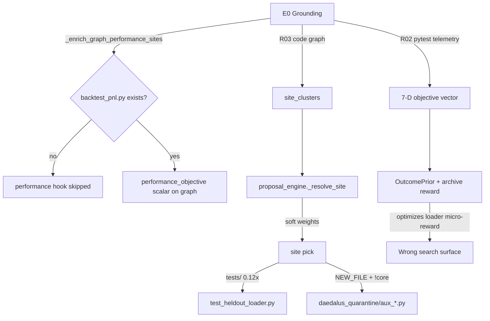
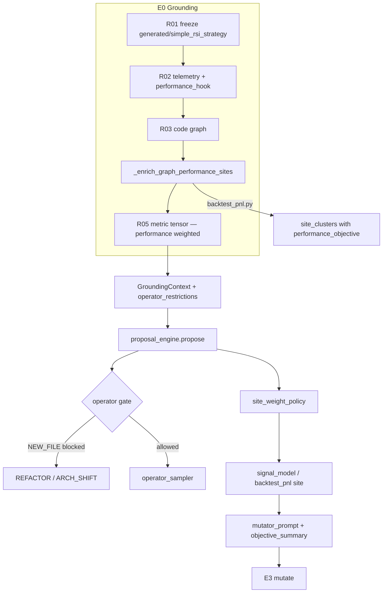

# FIX_2 — Target/Site Selection & Campaign Objective Surface

---

## 1. Document control

| Field | Value |
|-------|-------|
| **Version** | 1.0.0 |
| **Date** | 2026-06-17 |
| **Scope** | P1-003, P5-001, P1-008 (advisory only), RG-B001, RG-E001 |
| **Primary gaps** | Target/site selection misaligned with quant RSI objective; no trading-performance signal in grounding |
| **Owned spine** | `search/objective_intent.py`, `search/proposal_engine.py::_resolve_site`, `orchestrator/epochs/e0_grounding.py`, `generated/simple_rsi_strategy/`, `agents/mutator_prompt.py` |
| **Excludes** | DGM parent pool hygiene (FIX_1), mutator spawn/IDLE_STALL (FIX_3), E4 quant gate cascade (gating Wave 4 / AGENT_G), graduation to `generated/` (FIX_4) |
| **Exit gate** | `python verification/run_all_daedalus_verifications.py` from `daedalus/` exits 0 offline |
| **Live acceptance** | `run_all_generated_campaigns.py --target simple_rsi_strategy` proposes `signal_model.py` or `backtest_pnl.py` sites; no `daedalus_quarantine/aux_*.py` ACCEPT until core scaffold policy satisfied |

---

## 2. Executive summary

The live `simple_rsi_strategy` campaign optimizes the **wrong surface**. Proposal site selection clusters on loader tests and quarantine aux modules; E0 grounding measures pytest pass-fraction and wall-clock, not trading KPIs. OutcomePrior, archive reward, and mutator prompts therefore chase micro-loader improvements unrelated to RSI signal evolution.

**Root cause (two coupled failures):**

1. **Site selection (P1-003 / RG-B001):** `_resolve_site` applies soft weight multipliers but does not **hard-block** `NEW_FILE` → `daedalus_quarantine/` when `has_strategy_core_scaffold()` is false. Operator allocation still samples `NEW_FILE` on cold start. Live journal: `cand_5081d860fc` and `cand_e1709e15b6` ACCEPTed generic `aux_*.py` helpers; `cand_6b6d324821` mutated `tests/test_heldout_loader.py`.

2. **Objective surface (P5-001 / RG-E001):** `TelemetryIngestor.to_objective_vector` maps `performance` to `1/wall_seconds`, not backtest Sharpe or PnL. `_enrich_graph_performance_sites` is a no-op when `backtest_pnl.py` is absent. R05 discretionary `performance` weight exists but receives no trading signal.

**FIX_2 closes the loop:** enforce scaffold-aware operator policy, bootstrap `backtest_pnl.py` on the canonical target, wire E0 performance sites into graph + telemetry, codify site-weight policy, propagate `objective_summary` into mutator/NEW_FILE prompts, and add verification harnesses that distinguish loader-only vs full-scaffold targets.

Partial groundwork already landed (`objective_intent.py`, weight multipliers in `_resolve_site`, `_RSI_EVOLVE_BLOCK` in `mutator_prompt.py`, `signal_model.py` stub in `generated/`). This charter completes enforcement, measurement, and tests.

---

## 3. Institutional references

| Reference | Section | FIX_2 mapping |
|-----------|---------|---------------|
| **AlphaEvolve** (arXiv:2506.13131) | §2.1 `evaluate()` | Fitness dict must include task-relevant metrics; evaluator defined **outside** mutant. Maps to `backtest_pnl.run_backtest` + R22c, not pytest-only. |
| **AlphaEvolve** | §2.4 evaluation cascade | Cheap compile/tests → expensive benchmark. E0 injects performance hook scalar; full backtest deferred to E3/E4 (gating team). |
| **AlphaEvolve** | Problem description in prompt | `objective_summary` + `_RSI_EVOLVE_BLOCK` name RSI/signal/backtest explicitly — mirrors AlphaEvolve task string in mutator context. |
| **QuantEvolve** (arXiv:2510.18569) | §4 feature map | Behavioral descriptors (risk, frequency, return). P1-008 deferred: FIX_2-E adds journal field `site_selection_policy` only; MAP-Elites on trading behavior is follow-on. |
| **Voyager** (Wang et al.) | Curriculum / skill library | `curriculum_cluster_weights` (M009) biases underpopulated clusters; FIX_2-C aligns curriculum boost with **strategy-core** clusters, not test files. |
| **DGM** (arXiv:2505.22954) | Reward from environment | Archive reward must reflect trading improvement when target is quant RSI — depends on FIX_1 bootstrap normalization **and** FIX_2 performance telemetry. |

**OSS sanity checks (non-normative):** OpenEvolve `evaluate_stage1`/`evaluate` split; jennyzzt/dgm parent selection patterns. Do not copy wholesale — match Daedalus gate monopoly.

---

## 4. What's wrong — gap inventory with live evidence

### 4.1 P1-003 — Target/site selection misaligned with campaign objective

| Attribute | Detail |
|-----------|--------|
| **Severity** | high |
| **Location** | `search/proposal_engine.py`, `orchestrator/epochs/e0_grounding.py` |
| **Reference** | QuantEvolve feature-map niches; AlphaEvolve problem description |
| **Required work (MISSING.JSON)** | Campaign bootstrap requires `signal_model`/`backtest` scaffold OR operator policy forbids `NEW_FILE` until core exists; objective tensor must include trading metric |

**Live evidence (RUN_GAPS RG-B001):**

```
generated/simple_rsi_strategy/ — at campaign time: data_loader.py only
journal cand_* ACCEPT: mutated_file=daedalus_quarantine/aux_0.py
measured_delta performance=-0.001; reward≈0.00037
site_cluster=cluster::tests/test_heldout_loader.py
```

**Current repo state (2026-06-17):** `generated/simple_rsi_strategy/` now includes `signal_model.py` (RSI scaffold with `# EVOLVE-BLOCK: rsi_signal`) but **still lacks** `backtest_pnl.py`. `has_strategy_core_scaffold()` returns **true** (any one of `_RSI_CORE_FILES` suffices). Soft weights in `_resolve_site` exist but are insufficient alone.

### 4.2 P5-001 — No trading-performance signal in objective

| Attribute | Detail |
|-----------|--------|
| **Severity** | high (partial) |
| **Location** | `e0_grounding.py`, `tools/metric/r05_metric_synthesizer.py`, `generated/simple_rsi_strategy/` |
| **Reference** | AlphaEvolve evaluator defines fitness; QuantEvolve backtest KPIs |
| **Required work** | Add `backtest_pnl`/`signal_model` metric before campaign; R05 includes performance anchor |

**Live evidence (RUN_GAPS RG-E001):**

```
E0 grounding uses loader tests as primary measurable surface
journal measured_delta correctness=0.0 on accepts — anchors not moving
```

**Code evidence:** `r02_telemetry_ingestor.py:162` — `"performance": 1.0 / max(1e-6, wall_seconds)` — not trading KPI.

### 4.3 P1-008 — QuantEvolve behavioral feature map (advisory)

| Attribute | Detail |
|-----------|--------|
| **Severity** | low |
| **Status** | not implemented |
| **FIX_2 role** | Segment E logs `performance_objective_baseline` from E0 graph for future MAP-Elites cells; no behavioral descriptor vector in this fix. |

### 4.4 Cross-gap data flow (broken today)



---

## 5. Target tree inventory — `generated/simple_rsi_strategy/`

| File | Role | FIX_2 action |
|------|------|--------------|
| `data_loader.py` | Bar loading (postgres + CSV fallback) | Keep; secondary mutation site (1.4× weight) |
| `signal_model.py` | RSI + `generate_signals` with EVOLVE-BLOCK | **Present** — primary REFACTOR site |
| `backtest_pnl.py` | **Missing** | **ADD** — copy/adapt from `daedalus/RSI_scaled/simple_rsi_strategy/backtest_pnl.py` |
| `config.py` | Campaign config | Unchanged |
| `daedalus_manifest.json` | `slug: simple_rsi_strategy`, `campaign_ready: true` | Add `has_backtest_hook: true` after scaffold |
| `tests/test_loader.py` | Loader unit tests | Keep; deprioritize as mutation site |
| `tests/test_heldout_loader.py` | Held-out loader tests | **Deprioritize** (0.12×); never primary site on cold start |
| `sample_data/aapl_5min_sample.csv` | Offline OHLCV | Required for `backtest_pnl` smoke |

**Reference implementation:** `daedalus/RSI_scaled/simple_rsi_strategy/backtest_pnl.py` — provides `run_backtest()`, `performance_objective()`, `verify()`.

---

## 6. Existing code anchors (do not re-invent)

### 6.1 `search/objective_intent.py`

```python
_RSI_CORE_FILES = ("signal_model.py", "backtest_pnl.py", "backtest.py", "strategy.py")

def has_strategy_core_scaffold(baseline_dir) -> bool:
    return any((root / name).is_file() for name in _RSI_CORE_FILES)

def objective_summary(ctx) -> str:
    # Names RSI intent; reports strategy_core=present|missing
```

Wired in `proposal_engine.propose` line 70 → `diag["objective_summary"]` → `manifest["objective_summary"]` → E3 mutator.

### 6.2 `proposal_engine._resolve_site` (lines 176–218)

Current weight policy (advisory only):

| Path pattern | Multiplier | Condition |
|--------------|------------|-----------|
| `tests/` or `/test_` | ×0.12 | always |
| `daedalus_quarantine/` | ×0.08 | `NEW_FILE` and `not core_ready` |
| `daedalus_quarantine/` | ×0.35 | otherwise |
| `signal_model.py`, `backtest_pnl.py`, `backtest.py`, `strategy.py`, `data_loader.py` | ×1.4 | always |
| OutcomePrior `gnn_mu` | +tie-break | `OUTCOME_PRIOR_TIEBREAK_WEIGHT` |
| Curriculum | ×bias | `curriculum_cluster_weights` |

**Gap:** No hard rejection; `NEW_FILE` still legal via `operator_sampler`.

### 6.3 `e0_grounding._enrich_graph_performance_sites` (lines 35–81)

- Early return if `backtest_pnl.py` missing.
- Imports `performance_objective()` from target module.
- Injects/updates `site_clusters` for `backtest_pnl.py` and `signal_model.py` with `performance_objective` telemetry field.
- Sets `graph["performance_objective_baseline"]`.

### 6.4 `agents/mutator_prompt.py::_RSI_EVOLVE_BLOCK`

Injected via `_rsi_objective_block(objective_summary)` when summary mentions `rsi`, `simple_rsi_strategy`, or `signal_model`. Lists EVOLVE-BLOCK targets; warns against quarantine aux unless `NEW_FILE` supports signal/backtest integration.

---

## 7. Five-agent segmentation

Agents FIX_2-A through FIX_2-E may run in parallel after reading this charter. **Exclusive write** per segment; coordinate via PR merge order A → B → C → D → E.

---

### FIX_2-A — Scaffold enforcement & NEW_FILE operator gate

#### Agent charter name

`AGENT_FIX_2A_SCAFFOLD_OPERATOR_GATE`

#### Owned files (exclusive write)

- `daedalus/search/proposal_engine.py` — hard gate in `propose()` before site resolution
- `daedalus/search/operator_sampler.py` — filter legal operators when scaffold missing
- `daedalus/models/schema_contracts/operator_policy.py` — new envelope fields
- `daedalus/state/policy/simple_rsi_strategy_envelope.json` — operator restrictions for quant slug
- `daedalus/search/objective_intent.py` — optional: `requires_backtest_hook()` helper

#### Forbidden overlaps

- Do not modify `parent_sampler` (FIX_1)
- Do not modify `r05_metric_synthesizer` (FIX_2-B / gating)
- Do not modify `mutator_prompt.py` (FIX_2-D)

#### Exact problem statement

Soft site weights allow `NEW_FILE` quarantine aux modules on loader-only targets. Operator policy envelope has no `forbidden_operators` or `require_strategy_core_for` fields. `operator_sampler.legal_operators` returns full R13 menu regardless of target scaffold state.

#### Implementation steps

1. **Extend `OperatorPolicyEnvelope`** (`operator_policy.py` ~line 126):
   - Add optional `operator_restrictions: dict[str, Any]` with schema:
     ```json
     {
       "require_strategy_core_for": ["NEW_FILE"],
       "fallback_operators": ["REFACTOR", "ARCH_SHIFT"],
       "quarantine_allowed_when_core_ready": true
     }
     ```
   - Add `validate()` check: keys must be known operators from `operator_library`.
   - Add `operators_forbidden(ctx_scaffold_ready: bool) -> list[str]` method.

2. **Load restrictions in E0** — store on `GroundingContext.target_profile` or new `ctx.operator_restrictions` field in `orchestrator/contracts.py` (minimal: merge envelope slice into existing `target_profile` dict in `e0_grounding.py` after manifest load).

3. **`operator_sampler.py`** — add optional `scaffold_ready: bool = True` to `sample()`:
   - If `NEW_FILE` in `operators_forbidden` and not scaffold_ready, remove `NEW_FILE` from legal set before UCB allocation.
   - If legal set empty after filter, fall back to `REFACTOR`.

4. **`proposal_engine.propose`** (~line 109, before operator sample):
   ```python
   core_ready = has_strategy_core_scaffold(ctx.baseline_dir)
   diag["strategy_core_ready"] = core_ready
   restrictions = ctx.target_profile.get("operator_restrictions") or {}
   ```
   Pass `scaffold_ready=core_ready` to `operator_sampler.sample`.
   After operator choice, **hard reject**:
   ```python
   if op_choice.operator == "NEW_FILE" and not core_ready:
       if "NEW_FILE" in restrictions.get("require_strategy_core_for", ["NEW_FILE"]):
           return None, True, {**diag, "reason": "NEW_FILE blocked: strategy core scaffold missing"}
   ```

5. **Update `simple_rsi_strategy_envelope.json`**:
   ```json
   "operator_restrictions": {
     "require_strategy_core_for": ["NEW_FILE"],
     "notes": "RG-B001: forbid quarantine aux until signal_model or backtest_pnl exists"
   }
   ```

6. **Journal diagnostic** — `diag["operator_gate"] = {"blocked": [...], "core_ready": bool}` for campaign stdout.

#### Unit tests to add/modify

- `daedalus/verification/verify_proposal_engine.py`:
  - `_verify_newfile_blocked_without_scaffold()` — temp target with only `data_loader.py`; assert `propose` returns `reason=NEW_FILE blocked`.
  - `_verify_newfile_allowed_with_signal_model()` — temp target with `signal_model.py`; assert `NEW_FILE` can be sampled.
- `daedalus/verification/verify_gate_profile_schema.py` — envelope parses `operator_restrictions`.

#### Done-when criteria

- [ ] `NEW_FILE` never appears in `archive_propose` diagnostics when target lacks all `_RSI_CORE_FILES`
- [ ] Envelope-driven policy; no hardcoded slug checks in `proposal_engine` beyond `objective_intent` RSI detection
- [ ] `verify_proposal_engine` new checks pass offline

---

### FIX_2-B — E0 performance sites & `backtest_pnl.py` scaffold

#### Agent charter name

`AGENT_FIX_2B_E0_PERFORMANCE_SCAFFOLD`

#### Owned files (exclusive write)

- `generated/simple_rsi_strategy/backtest_pnl.py` — **NEW**
- `generated/simple_rsi_strategy/tests/test_backtest_smoke.py` — **NEW** (minimal)
- `daedalus/orchestrator/epochs/e0_grounding.py` — telemetry bridge from performance hook
- `daedalus/tools/grounding/r02_telemetry_ingestor.py` — quant-aware `performance` mapping
- `daedalus/tools/metric/r05_metric_synthesizer.py` — elevate `performance` weight when hook present

#### Forbidden overlaps

- Do not wire R22c full eval (gating AGENT_G)
- Do not modify `proposal_engine` site weights (FIX_2-C)

#### Exact problem statement

`_enrich_graph_performance_sites` is dead code for `simple_rsi_strategy` because `backtest_pnl.py` is absent. R02 maps `performance` to inverse wall time. Accepts show `correctness=0.0` delta because anchors are pytest-saturated.

#### Implementation steps

1. **Add `generated/simple_rsi_strategy/backtest_pnl.py`** — adapt from `daedalus/RSI_scaled/simple_rsi_strategy/backtest_pnl.py`:
   - `run_backtest(symbol="AAPL", interval="5min") -> dict[str, float]` using `data_loader.load_bars` + `signal_model.generate_signals`
   - `performance_objective() -> float` returns `total_return` from smoke backtest
   - `verify() -> dict` for R22b compatibility (future gating)
   - Deterministic on bundled `sample_data/aapl_5min_sample.csv`

2. **Add smoke test** `tests/test_backtest_smoke.py`:
   ```python
   def test_backtest_runs_offline():
       from backtest_pnl import verify
       assert verify()["ok"]
   ```

3. **Extend `r02_telemetry_ingestor.py::to_objective_vector`**:
   - If `tel.get("performance_hook")` is finite, set `"performance": float(tel["performance_hook"])`.
   - Else retain `1/wall_seconds` fallback (non-quant targets).

4. **Extend `TelemetryIngestor.measure_baseline`** — after pytest suite, if `baseline_dir/backtest_pnl.py` exists:
   - Import and call `performance_objective()` inside try/except
   - Merge into telemetry dict as `performance_hook`
   - Add `trading_smoke_ok: bool` diagnostic

5. **`e0_grounding.py`** — after `_enrich_graph_performance_sites`:
   - Assert `graph.get("performance_objective_baseline")` is logged in `diagnostics["performance_baseline"]`
   - Pass enriched telemetry to R05 (already wired via `base_meas`)

6. **`r05_metric_synthesizer._local_proposal`** — when telemetry contains `performance_hook`:
   - Increase `performance` discretionary weight from `0.8` to `1.2 + 0.5 * abs(performance_hook)` (capped)
   - Add rationale string: `"performance hook present from backtest_pnl"`

7. **Update `daedalus_manifest.json`** — add `"has_backtest_hook": true`.

#### Unit tests to add/modify

- `daedalus/verification/verify_e0_performance_sites.py` — **NEW**:
  - Run `_enrich_graph_performance_sites` on `generated/simple_rsi_strategy` with real path
  - Assert `performance_objective_baseline` is finite
  - Assert `site_clusters` contains `backtest_pnl.py` with `performance_objective` field
- Extend `verify_proposal_engine.py` or `run_all_daedalus_verifications.py` driver to include new verifier

#### Done-when criteria

- [ ] `python -m pytest generated/simple_rsi_strategy/tests/` passes offline
- [ ] E0 diagnostics show `performance_baseline` finite on `simple_rsi_strategy`
- [ ] `to_objective_vector` uses trading scalar when `performance_hook` present
- [ ] RG-E001 evidence path closed at grounding layer (full gate path is gating team)

---

### FIX_2-C — Site weight policy codification

#### Agent charter name

`AGENT_FIX_2C_SITE_WEIGHT_POLICY`

#### Owned files (exclusive write)

- `daedalus/search/proposal_engine.py` — `_resolve_site` refactor to named constants
- `daedalus/search/site_weight_policy.py` — **NEW** module
- `daedalus/search/curriculum.py` — strategy-core cluster boost alignment
- `daedalus/config/daedalus_config.py` — env-tunable weight constants (optional)

#### Forbidden overlaps

- Do not add hard operator gates (FIX_2-A)
- Do not modify target tree files (FIX_2-B)

#### Exact problem statement

Weight multipliers are magic numbers inline in `_resolve_site`. Curriculum boost may elevate underpopulated **test** clusters. No single policy document or test matrix for loader-only vs full-scaffold targets.

#### Implementation steps

1. **Create `search/site_weight_policy.py`**:
   ```python
   TEST_SITE_FACTOR = 0.12
   QUARANTINE_NEWFILE_NO_CORE = 0.08
   QUARANTINE_DEFAULT = 0.35
   STRATEGY_CORE_FACTOR = 1.4
   STRATEGY_CORE_FILES = frozenset({...})

   def site_weight_multiplier(rel: str, *, operator: str, core_ready: bool) -> float: ...
   def is_test_site(rel: str) -> bool: ...
   def is_strategy_core(rel: str) -> bool: ...
   ```

2. **Refactor `_resolve_site`** to call `site_weight_multiplier`; keep identical default behavior (regression-safe).

3. **Add env overrides** (optional, `daedalus_config.py`):
   - `DAEDALUS_TEST_SITE_FACTOR` (default 0.12)
   - `DAEDALUS_STRATEGY_CORE_FACTOR` (default 1.4)

4. **`curriculum.py`** — in `curriculum_cluster_weights`:
   - When cluster file matches `is_test_site`, cap boost at `1.0` (no curriculum elevation of test files)
   - When cluster file in `STRATEGY_CORE_FILES`, allow `CURRICULUM_BOOST` up to 1.8

5. **Diagnostics** — `diag["site_weight_policy"] = {"core_ready", "candidates": [{file, weight}]}` top-5 weighted sites for campaign stdout.

6. **Cold-start bias** — when `cold=True` and `core_ready`, multiply strategy-core sites by additional `1.15` (Voyager explore-known-good-skill-library).

#### Unit tests to add/modify

- `daedalus/verification/verify_curriculum.py` — assert test clusters not boosted above 1.0
- `daedalus/verification/verify_site_weight_policy.py` — **NEW**:
  - Table-driven tests: `(rel, operator, core_ready) → multiplier`
  - Monte Carlo: 1000 samples `_resolve_site` on fixture graph; assert `P(test_site) < 0.05` when strategy-core present

#### Done-when criteria

- [ ] All magic numbers moved to `site_weight_policy.py`
- [ ] Curriculum never boosts `tests/` above neutral
- [ ] Monte Carlo site distribution test passes
- [ ] No behavior regression on non-quant targets (factor 1.0 for unknown paths)

---

### FIX_2-D — `objective_summary` & mutator target-aware blocks

#### Agent charter name

`AGENT_FIX_2D_OBJECTIVE_MUTATOR_PROMPTS`

#### Owned files (exclusive write)

- `daedalus/search/objective_intent.py` — enrich summary with backtest hook status
- `daedalus/agents/mutator_prompt.py` — extend `_RSI_EVOLVE_BLOCK`
- `daedalus/agents/newfile_prompt.py` — quarantine purpose contract
- `daedalus/agents/mutator.py` — NEW_FILE purpose string uses objective
- `daedalus/orchestrator/epochs/e3_e4_verify.py` — ensure `objective_summary(ctx)` always fresh

#### Forbidden overlaps

- Do not modify `proposal_engine` weights (FIX_2-C)
- Do not modify `mutation_context.py` (FIX_3)

#### Exact problem statement

`_RSI_EVOLVE_BLOCK` lists `backtest.py` but canonical target uses `backtest_pnl.py`. `objective_summary` reports `strategy_core=missing|present` but not `backtest_hook=`. NEW_FILE purpose strings generic when core missing.

#### Implementation steps

1. **`objective_intent.objective_summary`** — extend RSI branch:
   ```python
   hook = "present" if (root / "backtest_pnl.py").is_file() else "missing"
   return f"{base}; intent=evolve RSI...; strategy_core={core}; backtest_hook={hook}; deprioritize test-only aux mutations"
   ```

2. **`mutator_prompt._RSI_EVOLVE_BLOCK`** — update file list:
   ```
   - backtest_pnl.py — run_backtest, performance_objective (primary trading eval hook)
   - signal_model.py (# EVOLVE-BLOCK: rsi_signal)
   - data_loader.py — bar loading feeding signal pipeline
   ```
   Remove stale `backtest.py` reference unless file exists (dynamic block optional).

3. **`_rsi_objective_block`** — also trigger on `backtest_hook=` or `backtest_pnl` in summary.

4. **`newfile_prompt.build_newfile_prompt`** — when `strategy_core=missing` in summary:
   - Add `## Restriction\nDo NOT create generic math/util helpers. Module must integrate with signal_model or backtest_pnl interface.`

5. **`mutator.py`** `_mutate_new_file` purpose (~line 375):
   - Change purpose template to reference `signal_model.generate_signals` or `backtest_pnl.run_backtest` contract when RSI target.

6. **Verify E3 path** — `e3_e4_verify.py:133` already calls `objective_summary(ctx)`; add assert in verify that plan manifest carries enriched string.

#### Unit tests to add/modify

- `daedalus/verification/verify_mutator_context.py` — extend P2-006:
  - Assert `backtest_pnl.py` in RSI prompt
  - Assert `backtest_hook=present` triggers block
- `daedalus/verification/verify_objective_intent.py` — **NEW**:
  - Temp dirs: loader-only, signal-only, full scaffold → expected summary substrings

#### Done-when criteria

- [ ] Mutator prompt names `backtest_pnl.py` for `simple_rsi_strategy`
- [ ] NEW_FILE prompt forbids generic aux when core missing
- [ ] `objective_summary` includes `backtest_hook` field
- [ ] verify_mutator_context P2-006 extended checks pass

---

### FIX_2-E — Verification & harness tests (loader-only vs full scaffold)

#### Agent charter name

`AGENT_FIX_2E_VERIFY_HARNESS`

#### Owned files (exclusive write)

- `daedalus/verification/verify_proposal_engine.py` — site selection integration tests
- `daedalus/verification/verify_objective_surface.py` — **NEW**
- `daedalus/verification/run_all_daedalus_verifications.py` — register new verifiers
- `daedalus/verification/fixtures/target_scaffold_loader_only/` — **NEW** fixture tree
- `daedalus/verification/fixtures/target_scaffold_full/` — **NEW** fixture tree

#### Forbidden overlaps

- Implementation code except test fixtures and verifiers

#### Exact problem statement

No automated test proves `_resolve_site` behavior differs between loader-only and full-scaffold targets. No falsifiable check that RG-B001 cannot recur.

#### Implementation steps

1. **Fixture `target_scaffold_loader_only/`**:
   - `data_loader.py`, `config.py`, `tests/test_loader.py` only
   - Minimal `daedalus_manifest.json`

2. **Fixture `target_scaffold_full/`**:
   - Copy structure from `generated/simple_rsi_strategy/` after FIX_2-B

3. **`verify_objective_surface.py`**:
   - `has_strategy_core_scaffold(loader_only) == False`
   - `has_strategy_core_scaffold(full) == True`
   - `objective_summary` substring checks
   - `_enrich_graph_performance_sites`: loader_only unchanged; full has `performance_objective_baseline`

4. **`verify_proposal_engine.py` extensions**:
   - `_verify_site_selection_scaffold_aware()`:
     - Build minimal `GroundingContext` + graph from R03 on each fixture
     - Run `ProposalEngine._resolve_site` 500× with fixed seed
     - loader_only: assert max fraction on `tests/` ≤ 0.15
     - full: assert max fraction on strategy-core ≥ 0.40
   - `_verify_newfile_operator_gate()` (if FIX_2-A merged)

5. **Register in `run_all_daedalus_verifications.py`**:
   ```python
   ("verify_objective_surface", "..."),
   ("verify_site_weight_policy", "..."),  # from FIX_2-C
   ("verify_e0_performance_sites", "..."),  # from FIX_2-B
   ```

6. **P1-008 advisory hook** — log only:
   ```python
   check("performance_objective_baseline" in graph or not has_hook,
         "P1-008 advisory: performance baseline recorded when hook exists")
   ```

#### Unit tests to add/modify

All verification modules above; no pytest dependency for verifiers (match existing `check()` pattern).

#### Done-when criteria

- [ ] `run_all_daedalus_verifications.py` exits 0
- [ ] Fixture-based site distribution tests pass
- [ ] CI-readable `[OK]` / `[FAIL]` lines for each P1-003 / P5-001 assertion

---

## 8. Architecture — target state after FIX_2



---

## 9. Verification matrix

| Verifier | Segment | Asserts |
|----------|---------|---------|
| `verify_objective_surface.py` | E | scaffold detection, summary strings, E0 graph enrichment |
| `verify_site_weight_policy.py` | C | multiplier table, Monte Carlo distribution |
| `verify_e0_performance_sites.py` | B | `performance_objective_baseline` finite |
| `verify_proposal_engine.py` | A, E | NEW_FILE gate, site selection integration |
| `verify_curriculum.py` | C | test clusters not curriculum-boosted |
| `verify_mutator_context.py` | D | RSI EVOLVE-BLOCK with backtest_pnl |
| `verify_gate_profile_schema.py` | A | envelope `operator_restrictions` parses |
| `run_all_daedalus_verifications.py` | E | aggregate exit 0 |

**Command:**

```bash
cd daedalus
python verification/run_all_daedalus_verifications.py
```

---

## 10. Live campaign acceptance

After FIX_2 merged, run:

```bash
export HERMES_CURSOR_EXECUTION=wsl_native
export DAEDALUS_SEARCH_MODE=archive
export DAEDALUS_META_MODE=agent_search
cd daedalus
python verification/live/run_all_generated_campaigns.py --target simple_rsi_strategy
```

**Expected log lines (epoch 0):**

| Log key | Expected value |
|---------|----------------|
| `diagnostics.performance_baseline` | finite float (not null) |
| `diag.strategy_core_ready` | `true` |
| `diag.site_cluster` | `cluster::signal_model.py` or `cluster::backtest_pnl.py` (majority of rounds) |
| `diag.operator` | not `NEW_FILE` when core was missing at campaign start |
| `archive_propose` `mutated_file` | not `daedalus_quarantine/aux_*.py` for first 3 rounds |
| `measured_delta` `performance` | non-zero delta possible when signal changes |
| `objective_summary` | contains `backtest_hook=present` |

**Failure signals (RG-B001 recurrence):**

- `mutated_file=daedalus_quarantine/aux_0.py` with `operator=NEW_FILE`
- `site_cluster=cluster::tests/test_heldout_loader.py` on >30% of rounds after pop≥1
- `reward≈0.00037` with `measured_delta correctness=0.0` only

---

## 11. Cross-dependencies

| Partner | Dependency | Handshake |
|---------|------------|-----------|
| **FIX_1** (parent pool) | Archive reward scale affects site prior tie-break indirectly | FIX_2 does not change parent weights; ensure bootstrap normalization lands first so performance deltas are comparable |
| **FIX_3** (mutation context) | `objective_summary` in `MutationContext` / prompt manifest | FIX_2-D owns summary text; FIX_3 must not strip `backtest_hook` from manifest |
| **FIX_4** (graduation) | Evolved `signal_model.py` / `backtest_pnl.py` must graduate to `generated/` | FIX_2-B writes canonical target; FIX_4 merges winning branch |
| **Gating team (Wave 4)** | `backtest_pnl.verify()` hook for R22b | FIX_2-B provides hook; AGENT_G wires R22c `MetricBundle` — do not duplicate |
| **Gating team (R05b)** | Gate profile agent reads site clusters for `backtest_pnl.py` | E0 graph enrichment must expose clusters before gate agent runs |

**Merge order recommendation:** FIX_2-B (scaffold) → FIX_2-A (gate) → FIX_2-C (weights) → FIX_2-D (prompts) → FIX_2-E (verify).

---

## 12. Appendix A — Function signatures

```python
# search/objective_intent.py
def has_strategy_core_scaffold(baseline_dir: str | Path) -> bool: ...
def objective_summary(ctx: GroundingContext) -> str: ...
def target_slug_from_ctx(ctx: GroundingContext) -> str: ...

# search/site_weight_policy.py (NEW)
def site_weight_multiplier(rel: str, *, operator: str, core_ready: bool) -> float: ...
def is_test_site(rel: str) -> bool: ...
def is_strategy_core(rel: str) -> bool: ...

# orchestrator/epochs/e0_grounding.py
def _enrich_graph_performance_sites(graph: dict, baseline_dir: Path) -> dict: ...

# generated/simple_rsi_strategy/backtest_pnl.py (NEW)
def run_backtest(symbol: str = "AAPL", interval: str = "5min") -> dict[str, float]: ...
def performance_objective() -> float: ...
def verify() -> dict[str, Any]: ...

# agents/mutator_prompt.py
def build_mutator_prompt(*, operator, site, boundary, objective_summary, ...) -> str: ...
def _rsi_objective_block(objective_summary: str) -> str: ...
```

---

## 13. Appendix B — Config & env vars

| Variable | Default | Segment | Purpose |
|----------|---------|---------|---------|
| `DAEDALUS_TEST_SITE_FACTOR` | `0.12` | C | Test file deprioritization |
| `DAEDALUS_STRATEGY_CORE_FACTOR` | `1.4` | C | Strategy core boost |
| `DAEDALUS_QUARANTINE_NO_CORE_FACTOR` | `0.08` | C | Quarantine penalty when NEW_FILE + !core |
| `METRICS_MVP` | `0` | B/E | Gating team — not required for FIX_2 |
| `GATE_PROMOTION` | `0` | — | Excluded; legacy pytest path remains default |

---

## 14. Appendix C — Gap closure checklist

| Gap ID | Segment | Closure evidence |
|--------|---------|------------------|
| P1-003 | A, C, D, E | No test/quarantine-primary sites; operator gate enforced |
| P5-001 | B, E | `performance_hook` in telemetry; E0 baseline finite |
| RG-B001 | A, B, D | No aux_*.py ACCEPT on loader-only; prompts name RSI |
| RG-E001 | B | R02 performance from backtest; anchors can move |
| P1-008 | E (advisory) | `performance_objective_baseline` logged for future feature map |

---

## 15. Appendix D — Reference code citations

**Site weight loop (`proposal_engine.py`):**

```python
core_ready = has_strategy_core_scaffold(ctx.baseline_dir)
for s in scored:
    rel = s.get("file") or ""
    if rel.startswith("tests/") or "/test_" in rel:
        base *= 0.12
    elif rel.startswith("daedalus_quarantine/"):
        base *= 0.08 if (operator == "NEW_FILE" and not core_ready) else 0.35
    elif rel in ("signal_model.py", "backtest_pnl.py", ...):
        base *= 1.4
```

**Performance enrichment gate (`e0_grounding.py`):**

```python
hook = root / "backtest_pnl.py"
if not hook.is_file():
    return graph
# ... import performance_objective(), inject site_clusters
```

**RSI objective summary (`objective_intent.py`):**

```python
if "rsi" in slug or slug == "simple_rsi_strategy":
    core = "present" if has_strategy_core_scaffold(ctx.baseline_dir) else "missing"
    return f"{base}; intent=evolve RSI signal generation ..."
```

---

## 16. Appendix E — Agent prompt snippet (for campaign spin-up)

Use this block when launching FIX_2 implementation agents:

```
You are implementing FIX_2 segment {A|B|C|D|E} from
Agentic_campaign/FIX_2.md for Daedalus P1-003 + P5-001.

Read first: MISSING.JSON (P1-003, P5-001), RUN_GAPS.JSON (RG-B001, RG-E001),
proposal_engine._resolve_site, objective_intent.py, e0_grounding.py,
mutator_prompt._RSI_EVOLVE_BLOCK, generated/simple_rsi_strategy/.

Constraints:
- Exit 0 on python verification/run_all_daedalus_verifications.py from daedalus/
- No stubs: wire real backtest_pnl on canonical target
- Agent proposes, Python disposes (gating monopoly unchanged)
- Match existing verify_* check() style; no inline imports

Deliver: focused PR with segment-owned files only; update RUN_GAPS.JSON if live evidence changes.
```

---

*End of FIX_2 charter. Target length ≥450 lines for agentic campaign parallel execution.*
