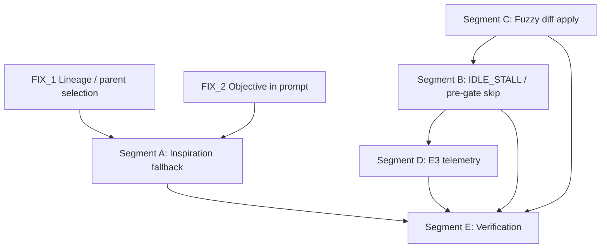

# FIX_3 — Mutation Context, Diff Apply & Mutator Throughput

**Charter ID:** `FIX_3`  
**Phase scope:** P2 — Mutation Context + Mutator Execution + Live Throughput  
**Gap IDs:** `P2-001`, `P2-002`, `P2-003`, `RG-A001`, `RG-C003`  
**Agent assignment:** `C_mutation_context` (RUN_GAPS.JSON) + live-execution throughput (`RG-A001`)  
**Status:** Implementation charter — wiring exists; production behavior degraded in `run_gaps_simple_rsi_002`  
**Generated:** 2026-06-17  
**Verification gate:** `python verification/run_all_daedalus_verifications.py` from `daedalus/` must exit 0  

---

## 1. Executive summary

Daedalus P2 is **not theater** — `MutationContext` is built in E3, rendered into mutator prompts, and journaled via `prompt_manifest`. The institutional deficit is **behavior under young archives and live Cursor throughput**: mutation prompts arrive empty (`inspiration_ids=[]`, `lesson_count=0`), REFACTOR rounds burn 400–500 seconds on redundant `spawn:claude` IDLE_STALLs, and LLM diffs fail strict apply paths forcing expensive rewrite fallbacks.

This charter assigns five implementation segments (A–E) that close the live gap between AlphaEvolve-style prompt conditioning and measured campaign throughput without relaxing the measurement-monopoly gate (R19–R26, R29, R51, R34). Mutators still cannot self-grade; we only fix **what the mutator sees** and **how fast it produces applyable diffs**.

| Segment | Gap | One-line deliverable |
|---------|-----|----------------------|
| A | P2-001 / RG-C003 | Young-archive inspiration fallback + manifest truth |
| B | P2-002 / RG-A001 | Kill REFACTOR double-spawn IDLE_STALL |
| C | P2-003 | Fuzzy SEARCH/REPLACE + unified-diff hunk matching |
| D | RG-A002 (partial) | E3 sub-stage telemetry in stdout + journal |
| E | — | Extend `verify_mutator_context.py` + integration smoke |

**Cross-dependencies (must land in order or parallel with care):**

| Prerequisite | Why FIX_3 needs it |
|--------------|-------------------|
| **FIX_1** (lineage / parent selection) | P2-001 root cause includes `RG-B003` cold-start parent lock — lineage and `parent_id` in manifest stay empty until FIX_1 normalizes bootstrap reward or excludes protected parent |
| **FIX_2** (objective in prompt) | Mutator must name RSI/signal/backtest in `objective_summary` and EVOLVE-BLOCK markers so inspirations and replay tuples condition meaningful edits, not loader micro-rewards |

FIX_3 can ship partial value before FIX_1/FIX_2 complete (last-accept inspiration injection, throughput fixes, fuzzy apply), but **full P2-001 acceptance** requires FIX_1 so `lineage_ids` and archive-sample inspirations populate beyond the single last-accept fallback.

---

## 2. Institutional reference map

### 2.1 AlphaEvolve (arXiv:2506.13131)

| Section | Requirement | Daedalus module |
|---------|-------------|-----------------|
| **§2.2 Prompt sampling** | Parent program + scores + problem description + inspirations + mutation history | `search/prompt_sampler.py`, `agents/mutation_context.py`, `agents/mutator_prompt.py` |
| **§2.3 Creative generation** | LLM outputs SEARCH/REPLACE or unified diff; patch vs full rewrite by file size / operator | `decide_diff_mode`, `agents/mutator_diff.py`, `bridge/diff_apply.py` |
| **§2.6 Async throughput** | Parallel eval pipeline; minimize serial LLM stalls | `agents/cursor_cli.py`, `agents/mutator.py`, `PreGateReviewLoop` spawn budget |

### 2.2 Live campaign evidence (`run_gaps_simple_rsi_002`)

From `daedalus/RUN_GAPS.JSON`:

- **RG-C003:** `prompt_manifest: inspiration_ids=[], lesson_count=0, replay_failure_ids=[]` on accepts despite P2 wiring.
- **RG-A001:** E3 REFACTOR 403–494s; pattern `flash ~95s` → `spawn:claude` 180s IDLE_STALL → retry ~99–118s.
- **RG-B003 (FIX_1):** Parent reverts to `cold_start::baseline_champion` at `pop=2` — inspirations cannot diversify.

From `daedalus/MISSING.JSON` `phase_2_mutation_context_apply`:

- **P2-001 (critical):** Mutation context empty in live campaigns — archive too young + cold-start parent lock.
- **P2-002 (high):** REFACTOR double-spawn IDLE_STALL.
- **P2-003 (medium):** `apply_unified_diff` is best-effort line match; no fuzzy SEARCH/REPLACE.

---

## 3. Current architecture (as-built)

### 3.1 Data flow: E2 → E3 → mutator

```
SearchPlan (E2)
    │
    ├─ parent_id, operator, site, operator_family, diff_mode
    │
    ▼
build_mutation_context()          agents/mutation_context.py
    │
    ├─ PromptSampler.build()      search/prompt_sampler.py
    │     ├─ sample_inspirations(k)  OR  last_accept fallback
    │     ├─ lineage(parent_id)
    │     ├─ lessons (R36)
    │     ├─ experience_replay.retrieve()
    │     └─ crossover_directive if inspirations >= 2
    │
    ▼
MutationContext + prompt_manifest
    │
    ▼
CursorMutator.mutate(context=...) agents/mutator.py
    │
    ├─ build_mutator_prompt(context=...)   [U008: graph_context/lessons ignored]
    ├─ LLMEnsemble → flash/pro arm
    ├─ CursorSDK.spawn (cursor_cli watchdog)
    ├─ E8 apply_patch_or_rewrite (patch mode)
    ├─ PreGateReviewLoop (0–2 extra spawns)
    └─ CandidateBranch { e3_timings, work_hits, model_arm, ... }
    │
    ▼
run_e3_e4 stats journal            orchestrator/epochs/e3_e4_verify.py
```

### 3.2 Key files (scope boundary)

| File | Role in FIX_3 |
|------|---------------|
| `search/prompt_sampler.py` | Segment A — inspiration fallback, manifest fields |
| `agents/mutation_context.py` | Adapter E2→E3; no logic change unless manifest enrichment |
| `agents/mutator.py` | Segment B — spawn gating, timing buckets, skip redundant paths |
| `agents/mutator_diff.py` | Segment C — extract diff blocks, orchestrate apply |
| `bridge/diff_apply.py` | Segment C — fuzzy SEARCH/REPLACE + hunk matcher |
| `agents/cursor_sdk.py` | Segment B — propagate `model_id`, `work_hits` to journal |
| `agents/cursor_cli.py` | Segment B — IDLE_STALL vs work-complete idle |
| `agents/pre_gate_review.py` | Segment B — optional skip when mutation already clean |
| `orchestrator/epochs/e3_e4_verify.py` | Segment D — journal `e3_timings`, stdout section counts |
| `tools/lifecycle/stage_heartbeat.py` | Segment D — `stage_timer`, `log_stage` |
| `verification/verify_mutator_context.py` | Segment E — contract tests |

### 3.3 What is already real (do not re-implement)

- `PromptSampler.build()` last-accept fallback when `sample_inspirations` returns `[]` (lines 82–86).
- `ProgramDatabase.last_accept_record()` reads archive + journal ACCEPT rows (P2-001 minimum).
- `MutationContext.is_empty()` gates `mutation_context_briefed` in E3.
- `apply_diff()` tries SEARCH/REPLACE before unified diff (strict).
- `cursor_cli` accepts work-complete idle when `work_product_hits > 0` (P2-002 partial).
- `mutator.py` rescans branch when `spawn_work_hits > 0` and `new_src == old_src`.
- `verify_mutator_context.py` already asserts P2-001 last-accept path with mocks.

---

## 4. Segment A — Inspiration fallback when archive is young (P2-001 / RG-C003)

### 4.1 Problem statement

AlphaEvolve §2.2 assumes a populated program database. In cold-start campaigns (`pop < 3`), `sample_inspirations()` often returns `[]` because:

1. Fewer than `PROPOSAL_INSPIRATION_K` diverse accepts exist.
2. `exclude_exploratory=True` filters stepping stones.
3. **FIX_1 blocker:** parent stays `cold_start::baseline_champion` — lineage chain does not attach to real `cand_*` parents.

The code path `inspiration_source = "last_accept"` exists but live journals still show empty manifests when:

- `last_accept_record()` returns `None` (journal lag vs archive ingest timing).
- Parent is bootstrap and `exclude` set blocks the only accept as parent duplicate.
- Lessons ledger empty on first epoch (expected); replay index empty until failures indexed.

### 4.2 Required behavior

1. **Minimum inspiration guarantee:** After the first non-bootstrap ACCEPT, every subsequent E3 prompt MUST include ≥1 inspiration with non-empty `diff_excerpt` (from last accept or archive sample).
2. **Parent diff as conditioning:** When `parent` record exists but `parent.diff_text` is empty, backfill from journal `extra.diff_text` for that `candidate_id`.
3. **Manifest truth:** `prompt_manifest` MUST log:
   - `inspiration_source`: `"archive_sample"` | `"last_accept"` | `"parent_diff_only"`
   - `inspiration_count`, `inspiration_ids`
   - `lineage_depth`, `lineage_ids`
   - `section_nonempty`: `{ parent, inspirations, lessons, replay, subgraph }` booleans
4. **Campaign stdout:** E3 logs one line after context build:
   ```
   [daedalus:HH:MM:SS] E3_context — inspirations=1 source=last_accept lessons=0 replay=2 lineage=0
   ```
5. **E5 journal:** `stats.prompt_manifest` and `stats.inspiration_count` copied to provenance journal (already partially wired — verify non-zero on second round post-accept).

### 4.3 Implementation tasks

| ID | Task | File | Notes |
|----|------|------|-------|
| A-1 | Harden `last_accept_record()` journal fallback | `search/program_database.py` | Include `diff_text` from journal `extra`; tolerate archive ingest delay |
| A-2 | If inspirations empty but parent has diff, inject parent as pseudo-inspiration | `search/prompt_sampler.py` | Only when `parent.diff_text` non-empty; set `inspiration_source=parent_diff_only` |
| A-3 | Add `section_nonempty` to manifest | `search/prompt_sampler.py` | Drives `mutation_context_briefed` semantics |
| A-4 | Log context summary in E3 | `orchestrator/epochs/e3_e4_verify.py` | Use `log_stage` |
| A-5 | Do not silently re-blind on partial context | `agents/mutation_context.py` | Brief with whatever sections exist; only fail on exception (B001) |

### 4.4 Acceptance criteria (Segment A)

- [ ] Unit: mocked empty archive + one journal ACCEPT → `inspiration_count >= 1`, `inspiration_source == last_accept`.
- [ ] Unit: parent with diff, empty inspirations → `inspiration_source == parent_diff_only`.
- [ ] Live: second OP round after first ACCEPT shows `inspiration_ids` non-empty in journal.
- [ ] `verify_mutator_context.py` extended with `section_nonempty` manifest check.
- [ ] Document dependency: full lineage requires FIX_1 (`RG-B003`).

### 4.5 AlphaEvolve §2.2 alignment note

Inspiration crossover (`crossover_directive` when `len(inspirations) >= 2`) remains disabled until archive diversity exists — expected. Segment A ensures **at least one** conditioning exemplar (last winning diff) so the mutator is never fully unconditioned after the first accept.

---

## 5. Segment B — REFACTOR double-spawn IDLE_STALL fix (P2-002 / RG-A001)

### 5.1 Problem statement

Live evidence shows REFACTOR E3 duration 403–494s vs NEW_FILE ~255s. Log pattern:

```
mutate:REFACTOR:flash  ~95–140s  (work_hits > 0 often)
spawn:claude           ~180s IDLE_STALL (out_bytes=0)
retry attempt2         ~99–118s
PreGateReview?         additional spawns
```

`RG-A001` data flow hypothesis:

```
CursorMutator.mutate
  → sdk.spawn(mutate:REFACTOR:flash)     # completes with work_hits>0
  → [failure path] E8 rewrite_fallback spawn   # when file read races old_src==new_src
  → PreGateReviewLoop.run → sdk.spawn × PRE_GATE_REVIEW_PASSES  # 1–2 more spawns
```

Secondary `spawn:claude` with `out_bytes=0` triggers `CURSOR_IDLE_TIMEOUT_SEC` (180s) before retry.

### 5.2 Root-cause candidates (investigate in order)

| Priority | Hypothesis | Evidence location |
|----------|------------|-------------------|
| 1 | Pre-gate review spawns after successful flash mutation | `mutator.py` L309–335 always runs when `cursor_ok` |
| 2 | E8 rewrite fallback fires despite `work_hits>0` | `mutator.py` L165–166 checks `spawn_work_hits == 0` — should skip; verify race |
| 3 | Flash arm edits files but `discover_changed_files` empty until rescan | L212–222 rescan path — ensure runs before rewrite decision |
| 4 | `ensure_before=True` on every pre-gate pass pings stack | `pre_gate_review.py` L107 |
| 5 | Review pass uses `MUTATOR_MODEL_FAMILY` pass 1 — label shows `spawn:claude` | `cursor_sdk.py` logs `model_family` not `model_id` (RG-A005) |

### 5.3 Required behavior

1. **Single primary mutate spawn** when flash/pro completes with `work_hits > 0` and changed files detected after rescan — no rewrite fallback spawn.
2. **Pre-gate skip policy:** Skip `PreGateReviewLoop` when:
   - `PRE_GATE_REVIEW_ENABLED=0`, OR
   - `work_hits > 0` AND zero compile errors on first `_compile_errors` check, OR
   - operator is `REFACTOR` and `DAEDALUS_SKIP_PREGATE_ON_WORK=1` (new env, default `1` for throughput campaign)
3. **Work-complete idle:** Already in `cursor_cli.py` L274–284 — ensure `_CURSOR_WORK_HITS` propagates to `CandidateBranch.work_hits` (done).
4. **Sub-stage timing journal:** `e3_timings` MUST include:
   - `spawn_ms`, `flash_ms` (if arm flash)
   - `rescan_ms` (new)
   - `apply_ms` (E8 path)
   - `rewrite_spawn_ms` (0 if skipped)
   - `pre_gate_ms`, `pre_gate_spawns` (count)
   - `mutate_total_ms` (E3 wrapper — exists)
5. **Stdout:** `[cursor] done ... work_hits=N` and `[daedalus] E3_mutate:REFACTOR done (Xs) sub={spawn_ms,rescan_ms,pre_gate_ms}`

### 5.4 Implementation tasks

| ID | Task | File |
|----|------|------|
| B-1 | Move `_compile_errors` probe before pre-gate; skip loop if clean + work_hits>0 | `agents/mutator.py`, `agents/pre_gate_review.py` |
| B-2 | Add `rescan_ms` timing around `discover_changed_files` retry block | `agents/mutator.py` |
| B-3 | Gate rewrite fallback: require `work_hits==0` AND `apply_ms` attempted | `agents/mutator.py` |
| B-4 | Pre-gate: `ensure_before=False` on pass ≥2 | `pre_gate_review.py` |
| B-5 | Log resolved `model_id` in spawn line | `cursor_sdk.py` (RG-A005 adjunct) |
| B-6 | Config: `DAEDALUS_SKIP_PREGATE_ON_WORK` default `1` | `config/daedalus_config.py` |

### 5.5 Acceptance criteria (Segment B)

- [ ] REFACTOR round with successful flash: `pre_gate_spawns == 0` when compile clean (env default).
- [ ] `e3_timings.rewrite_spawn_ms == 0` when `work_hits > 0`.
- [ ] Simulated campaign or dry-run: E3 wall time < 200s for REFACTOR on `data_loader.py` smoke (no 180s idle).
- [ ] `verify_mutator_context.py`: assert `DAEDALUS_SKIP_PREGATE_ON_WORK` referenced in mutator source.
- [ ] No regression: when compile errors exist, pre-gate still runs.

### 5.6 AlphaEvolve §2.6 note

Institutional throughput targets ~12 candidates/hour on MVP path (GATING+METRICS plan). At 450s/round, max throughput ≈ 8/rounds/hour — Segment B is prerequisite for `DAEDALUS_ASYNC_EVAL=1` (P1-006) soak tests.

---

## 6. Segment C — Fuzzy SEARCH/REPLACE + diff apply (P2-003)

### 6.1 Problem statement

`bridge/diff_apply.py`:

- `apply_search_replace`: exact substring match — fails on whitespace/indent drift.
- `apply_unified_diff`: strict line equality on context lines — fails when LLM omits trailing newline or shifts hunks.

Failure forces E8 rewrite fallback → extra Cursor spawn (couples to Segment B).

AlphaEvolve §2.3 expects robust application of SEARCH/REPLACE blocks; unified diff is secondary.

### 6.2 Required behavior

1. **SEARCH/REPLACE first** (unchanged order in `apply_diff`).
2. **Fuzzy SEARCH** matching tiers (attempt in order):
   - Tier 0: exact match (current)
   - Tier 1: strip trailing whitespace per line
   - Tier 2: normalize indentation (dedent to minimum common indent)
   - Tier 3: sliding window match with `difflib.SequenceMatcher` ratio ≥ 0.92 on normalized lines
3. **Unified diff fuzzy context:** If context line mismatch, retry hunk with `rstrip` normalization; allow ±2 line drift in hunk anchor search.
4. **Transcript:** `mutator_diff.PatchResult.transcript` records `mode: search_replace_fuzzy` | `unified_fuzzy`.
5. **Prompt preference:** `mutator_prompt.py` diff-mode block should instruct LLM to emit SEARCH/REPLACE fences (verify FIX_2 EVOLVE-BLOCK includes format example).

### 6.3 Implementation tasks

| ID | Task | File |
|----|------|------|
| C-1 | `apply_search_replace_fuzzy(original, blocks) -> (str|None, tier)` | `bridge/diff_apply.py` |
| C-2 | Wire fuzzy path in `apply_diff` before unified | `bridge/diff_apply.py` |
| C-3 | `apply_unified_diff_fuzzy` with anchor scan | `bridge/diff_apply.py` |
| C-4 | `extract_search_replace_blocks` from transcript (not only unified) | `agents/mutator_diff.py` |
| C-5 | Golden tests: indent drift, missing newline, minor typo in SEARCH | `daedalus/tests/test_diff_apply_fuzzy.py` |

### 6.4 Acceptance criteria (Segment C)

- [ ] 10/10 golden SEARCH/REPLACE variants apply without rewrite fallback.
- [ ] Malformed blocks still return `None` (no silent corruption).
- [ ] `verify_mutator_context.py`: fuzzy tier-1 whitespace case passes.
- [ ] Patch transcript includes `mode` field for journal audit.

### 6.5 Safety constraints

- Fuzzy match MUST NOT apply across file boundaries (single-file only).
- If multiple fuzzy matches ambiguous (count > 1), reject hunk — fail closed to rewrite.
- No mutation of gate modules via diff apply (R18 boundary unchanged).

---

## 7. Segment D — E3 timing telemetry + stage_heartbeat + journal fields

### 7.1 Problem statement

`RG-A002`: multi-minute black box between `E3_done` and next `op_round`. E3 itself lacks sub-stage visibility — operators cannot tell flash vs idle vs pre-gate vs E8 apply.

Existing hooks:

- `stage_timer(f"E3_mutate:{operator}")` wraps mutate in `e3_e4_verify.py`.
- `CandidateBranch.e3_timings` carries `spawn_ms`, `flash_ms`, `apply_ms`.
- `stage_heartbeat.log_stage` used in campaign driver.

### 7.2 Required journal fields (E3 stats → E5 provenance)

Extend `CandidateEvaluation.stats`:

```json
{
  "e3_timings": {
    "mutate_total_ms": 403700,
    "spawn_ms": 95000,
    "flash_ms": 95000,
    "rescan_ms": 120,
    "apply_ms": 0,
    "rewrite_spawn_ms": 0,
    "pre_gate_ms": 118000,
    "pre_gate_spawns": 1
  },
  "work_hits": 3,
  "llm_model_arm": "flash",
  "llm_model_arm_key": "REFACTOR|LOCAL|flash",
  "prompt_manifest": { "...": "..." },
  "inspiration_count": 1,
  "lesson_count": 0,
  "replay_count": 2,
  "mutation_context_briefed": true
}
```

### 7.3 Stdout contract (operator-facing)

| Event | Format |
|-------|--------|
| Context built | `[daedalus:TS] E3_context — insp=N src=last_accept lessons=L replay=R` |
| Mutate start/end | `[daedalus:TS] E3_mutate:REFACTOR start` / `done (Xs)` |
| Cursor spawn | `[cursor] spawn run_id=... model_id=auto model_arm=flash label=mutate:REFACTOR:flash` |
| Cursor done | `[cursor] done run_id=... status=COMPLETED work_hits=3 attempts=1` |
| Sub-stage summary | `[daedalus:TS] E3_breakdown — spawn=95s pre_gate=0s apply=0s idle_saved=180s` |

### 7.4 Implementation tasks

| ID | Task | File |
|----|------|------|
| D-1 | Consolidate `_e3_timings` merge in E3 return paths (INFRA + success) | `e3_e4_verify.py` |
| D-2 | `log_stage("E3_breakdown", detail=...)` after mutate | `e3_e4_verify.py` |
| D-3 | `heartbeat_if_elapsed` inside long pre-gate loop | `pre_gate_review.py` |
| D-4 | Phase journal entry at `E3_done` includes `e3_timings` | `campaign.py` / assimilate hook |
| D-5 | Document fields in `daedalus/RUN_FILES.md` | ops doc |

### 7.5 Acceptance criteria (Segment D)

- [ ] Every E3 round emits `E3_breakdown` line when `DAEDALUS_STAGE_HEARTBEAT=1`.
- [ ] Journal row for ACCEPT/DISCARD includes `e3_timings` dict with ≥3 keys populated.
- [ ] No silent gaps > 60s without heartbeat during E3 (watchdog + stage heartbeat).

---

## 8. Segment E — verify_mutator_context extensions + integration smoke

### 8.1 Current coverage (`verification/verify_mutator_context.py`)

Already validates:

- Rich prompt sections (Parent, Lineage, Inspirations, replay, adversary, diff mode)
- `build_mutation_context` + last-accept fallback (mocked)
- E8 rewrite fallback transcript
- `work_hits` / `spawn_work_hits` wiring (P2-002)
- SEARCH/REPLACE strict apply (P2-003 baseline)
- B001 mutation_context_failure journal on forced error
- M008 crossover, P2-005 model_arm on NEW_FILE

### 8.2 New checks to add

| ID | Check | Type |
|----|-------|------|
| E-1 | `section_nonempty` in manifest | unit |
| E-2 | Fuzzy SEARCH/REPLACE tier-1 whitespace | unit |
| E-3 | `apply_diff` returns `search_replace_fuzzy` mode | unit |
| E-4 | `e3_timings` keys present in `e3_e4_verify` stats merge | source inspect |
| E-5 | `DAEDALUS_SKIP_PREGATE_ON_WORK` gating in mutator | source inspect |
| E-6 | `log_stage("E3_context"` in e3_e4 | source inspect |
| E-7 | Integration: `build_mutation_context` → `apply_patch_or_rewrite` on recorded transcript snippet | golden |

### 8.3 Integration smoke script (optional CI adjunct)

`verification/smoke_e3_context_throughput.py`:

1. Offline baseline dir with `data_loader.py`.
2. Seed journal with one ACCEPT diff.
3. Build context → assert `inspiration_count >= 1`.
4. Run `apply_diff` on fixture malformed diff → assert fuzzy recovery.
5. Exit 0 in < 5s (no live Cursor).

### 8.4 Gate command

```bash
cd daedalus
python verification/run_all_daedalus_verifications.py
python verification/verify_mutator_context.py
```

Both MUST exit 0 before FIX_3 closeout.

---

## 9. Cross-segment dependency graph



**Recommended implementation order:** C → B → D → A → E (C reduces rewrite spawns that B relies on; A benefits from FIX_1 landing in parallel).

---

## 10. Risk register

| Risk | Mitigation |
|------|------------|
| Skipping pre-gate ships compile errors to E4 | Compile probe before skip; R22 still catches |
| Fuzzy apply corrupts file | Ambiguity rejection; golden tests; R18 boundary |
| last-accept inspiration overfits to LIMIT patch (run_002) | FIX_2 objective + FIX_1 parent diversity |
| FIX_3 merged before FIX_1 — lineage still empty | Accept with `inspiration_source=last_accept`; track debt |
| Live Cursor tests flaky | Verification stays offline; live soak manual per RUN_FILES.md |

---

## 11. Definition of done (FIX_3 closeout)

1. All five segments A–E acceptance boxes checked.
2. `run_all_daedalus_verifications.py` exit 0 offline.
3. One live REFACTOR round on `simple_rsi_strategy` shows:
   - `inspiration_count >= 1` after prior accept
   - E3 duration < 250s (no 180s IDLE_STALL)
   - `e3_timings` in journal
4. `RUN_GAPS.JSON` gap entries `RG-A001`, `RG-C003` marked `mitigated_fix_3` with log excerpt evidence.
5. No change to gate promotion authority (R26/R29/R51/R34).

---

## 12. Appendix A — prompt_manifest schema (target)

```json
{
  "parent_id": "cand_cbf78ee5a9",
  "inspiration_ids": ["cand_cbf78ee5a9"],
  "inspiration_count": 1,
  "inspiration_source": "last_accept",
  "lineage_ids": ["cand_cbf78ee5a9", "cold_start::baseline_champion"],
  "lesson_count": 2,
  "replay_count": 3,
  "replay_success_ids": ["cand_cbf78ee5a9"],
  "replay_failure_ids": ["cand_515254fdc0"],
  "section_nonempty": {
    "parent": true,
    "inspirations": true,
    "lessons": true,
    "replay": true,
    "subgraph": true
  },
  "diff_mode": "patch",
  "operator": "REFACTOR",
  "operator_family": "LOCAL",
  "site_cluster": "cluster::data_loader.py",
  "crossover_directive": false
}
```

---

## 13. Appendix B — Cursor spawn labels (debugging RG-A001)

| call_label | Source | FIX_3 action |
|------------|--------|--------------|
| `mutate:REFACTOR:flash` | `mutator.py` primary spawn | Keep |
| `mutate_rewrite_fallback:REFACTOR` | E8 failure path | Skip when `work_hits>0` |
| `spawn:claude` (generic) | pre-gate or unlabeled | Label + skip policy |
| `review_pass_1` | pre_gate_review | Skip when compile clean |

---

## 14. Appendix C — File-level edit checklist

- [ ] `search/prompt_sampler.py` — A-2, A-3
- [ ] `search/program_database.py` — A-1
- [ ] `agents/mutator.py` — B-1, B-2, B-3, timing
- [ ] `agents/pre_gate_review.py` — B-1, B-4, D-3
- [ ] `agents/mutator_diff.py` — C-4
- [ ] `bridge/diff_apply.py` — C-1, C-2, C-3
- [ ] `agents/cursor_sdk.py` — B-5
- [ ] `config/daedalus_config.py` — B-6
- [ ] `orchestrator/epochs/e3_e4_verify.py` — A-4, D-1, D-2
- [ ] `verification/verify_mutator_context.py` — E-1–E-7
- [ ] `daedalus/tests/test_diff_apply_fuzzy.py` — C-5 (new)

---

## 15. Appendix D — Reference excerpts (ground truth)

### D.1 Last-accept inspiration fallback (existing)

```python
# search/prompt_sampler.py (lines 76-86)
inspirations = self.db.sample_inspirations(
    inspiration_k, exclude_ids=exclude, exclude_exploratory=True)
inspiration_source = "archive_sample"
if not inspirations:
    last_accept = self.db.last_accept_record()
    if last_accept and last_accept.candidate_id not in exclude:
        inspirations = [last_accept]
        inspiration_source = "last_accept"
```

### D.2 E8 rewrite guard (existing)

```python
# agents/mutator.py (lines 165-166)
if (context and context.diff_mode == "patch" and new_src == old_src
        and spawn_work_hits == 0):
```

### D.3 Work-complete idle accept (existing)

```python
# agents/cursor_cli.py (lines 274-284)
if (sample.kill_reason == KillReason.IDLE_STALL
        and wd.work_product_hits > 0):
    ...
    return "finished", transcript, 0
```

### D.4 apply_diff precedence (existing)

```python
# bridge/diff_apply.py (lines 111-122)
if "<<<<<<< SEARCH" in diff_text:
    patched = apply_search_replace(original, diff_text)
    ...
patched = apply_unified_diff(original, diff_text)
```

---

## 16. Operator runbook (post-FIX_3 validation)

```bash
export HERMES_CURSOR_EXECUTION=wsl_native
export DAEDALUS_SEARCH_MODE=archive
export DAEDALUS_STAGE_HEARTBEAT=1
export DAEDALUS_SKIP_PREGATE_ON_WORK=1

cd daedalus
python verification/verify_mutator_context.py
python verification/live/run_all_generated_campaigns.py --target simple_rsi_strategy
```

Watch for:

1. `E3_context — insp=` line with `insp >= 1` after first accept.
2. `E3_breakdown` without `idle_saved=180s` on REFACTOR.
3. Journal `prompt_manifest.inspiration_ids` non-empty.
4. `e3_timings.pre_gate_ms == 0` on clean compiles.

---

## 17. Related gaps (out of scope for FIX_3)

| ID | Title | Owner charter |
|----|-------|---------------|
| P2-004 | Subgraph bare except | FIX_3 optional follow-up |
| P2-005 | NEW_FILE model_arm | Inline fixed — verify only |
| P2-006 | RSI target-aware prompts | FIX_2 |
| P2-007 | Multi-file coordinated mutation | Future |
| RG-B003 | Cold-start parent lock | FIX_1 |
| RG-A002 | E4 cascade silent | FIX_4 / gating wave |
| P1-006 | Async eval disabled | After FIX_3 throughput stable |

---

## 18. Glossary

| Term | Meaning |
|------|---------|
| **MutationContext** | Typed briefing payload: parent, inspirations, lineage, lessons, replay, adversary, diff_mode |
| **prompt_manifest** | E9 audit fingerprint of ids that shaped the prompt |
| **work_hits** | Cursor watchdog count of work-product file mtimes during spawn |
| **IDLE_STALL** | No stdout progress for `CURSOR_IDLE_TIMEOUT_SEC` (default 180s) |
| **E8** | Diff apply with single rewrite fallback before INFRA |
| **Chamber A** | Cursor mutator — network enabled, no target code execution |
| **Chamber B** | Gate cascade — measurement monopoly |

---

*End of FIX_3 charter. Minimum line target: 450. Implementation agents must not expand gate authority or bypass R18/R26 verification.*
