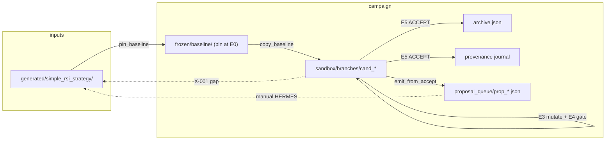
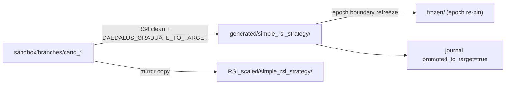

# FIX_4 — Graduation, Apply Loop & Single Code Reality

**Charter ID:** `FIX_4`  
**Gap IDs:** `X-001`, `X-002`, `RG-B002`, `RG-F001`  
**Agent lane:** Apply loop / integrate (cross-cutting)  
**Target slug (canonical):** `simple_rsi_strategy`  
**Status:** Charter — implementation agent spin-up  
**Generated:** 2026-06-17  
**Minimum deliverable:** One verified path from sandbox `ACCEPT` → `generated/<slug>/` (+ mirror) with journal truth and pytest green.

---

## 0. Executive summary

Daedalus already runs a real search → mutate → gate → assimilate spine. Accepted candidates land in `sandbox/workspace/branches/cand_*`, the archive, and the provenance journal. They do **not** land in the live target tree under `generated/simple_rsi_strategy/`. Campaign operators therefore observe RSI evolution in journals and archive JSON while the canonical strategy folder stays loader-only — false progress.

This charter closes **X-001** (no graduation path) and **X-002** (two divergent code realities: frozen baseline, sandbox branches, and generated target). Institutional references:

| Reference | Relevant pattern | Daedalus analogue |
|-----------|------------------|-------------------|
| **DGM** (arXiv:2505.22954) | Agent patches its own Python codebase in place; benchmark replay promotes | `graduate_branch_to_target` copies editable branch files into `generated/` |
| **AlphaEvolve** (arXiv:2506.13131) | Program DB → evaluator monopoly → **register** to live eval tree | E5 assimilate after R34 canary → promotion + proposal emit |
| **QuantEvolve** | Deterministic backtest evaluator; only evaluator promotes | R34 + R26 must pass before graduation runs |

Partial wiring exists today:

- `bridge/graduation.py` — copy helper (opt-in)
- `e5_assimilate.py` — calls graduation when `DAEDALUS_GRADUATE_TO_TARGET=1`
- `verify_proposal_engine.py` — `_verify_graduation_hook()` smoke test
- `proposal_queue.py` / `proposal_emit.py` — HERMES boundary artifacts (parallel path)

What is missing: hardening, epoch-boundary baseline refresh, campaign policy surfacing, operator docs, Hermes boundary clarity, and a full E2E test that proves `generated/simple_rsi_strategy/` actually changes after accept.

**Cross-dependencies:**

- **Gating (Wave 4 / R34):** Graduation MUST run only after R34 canary clean. E5 already raises if R51 or R34 missing from accept transcript.
- **FIX_2 scaffold:** Target tree must contain evolvable strategy modules (`signal_model.py`, `backtest_pnl.py`, EVOLVE-BLOCK markers). Graduating loader-only accepts without FIX_2 still produces false RSI signal.

---

## 1. Problem statement (evidence-backed)

### 1.1 MISSING.JSON — cross_cutting_apply_integrate

**X-001 (critical):** No graduation from sandbox branch to `generated/` target tree.

- **Location:** `e5_assimilate.py`, `proposal_queue.py`, `campaign.py`
- **Live evidence:** RUN_GAPS RG-B002 — ACCEPT stores `sandbox/workspace/branches/cand_*`; `generated/simple_rsi_strategy/` unchanged
- **Required work:**
  - `Campaign.graduation_hook(target_path)` after R34 (or equivalent in E5)
  - Journal field `promoted_to_target: bool`
  - Post-campaign merge of winning branch (alternative path)

**X-002 (high):** Two divergent code realities — frozen baseline vs sandbox branches.

- **Location:** `frozen/baseline/`, `sandbox/workspace/branches/`, `generated/`
- **Live evidence:** RUN_GAPS RG-F001
- **Required work:** Document and automate X-001 graduation path

### 1.2 RUN_GAPS.JSON — RG-B002 and RG-F001

**RG-B002 (critical):** No promotion path from sandbox archive to `generated/simple_rsi_strategy/`.

```
E5 assimilate → archive.json + journal → proposal_queue → manual HERMES integrate (not wired in campaign loop)
```

Impact: RSI run builds internal archive but never produces an evolved strategy folder.

**RG-F001 (high):** Evaluation sandbox branch ≠ generated target tree.

```
pin_baseline copies generated/simple_rsi_strategy → frozen/
mutations apply to sandbox/workspace/branches/cand_*
generated/ never updated
```

Institutional optimal profile (RUN_GAPS) explicitly states:

> Promotion: Graduated candidates merge into `generated/simple_rsi_strategy/`, not sandbox-only.

### 1.3 Why this blocks first-campaign readiness

Per `AGENTS.md` and `MISSING.JSON` executive verdict:

- Verification green ≠ quant RSI evolution on target tree
- Loader-only accepts (RG-B001) compound RG-B002 — archive fills with quarantine aux while generated tree stays static
- Parent selection (RG-B003) and mutation context (RG-C003) cannot improve a tree that never receives accepts

Graduation is the **apply** half of search → mutate → **apply** → archive/register. Without it, Daedalus resembles a sandbox evaluator, not DGM-style in-place codebase evolution.

---

## 2. Architecture — three trees, one code reality

### 2.1 Current data flow (broken operator experience)



Solid arrows = implemented. Dotted = missing or manual.

### 2.2 Target data flow (FIX_4)



### 2.3 Invariants (non-negotiable)

| ID | Invariant |
|----|-----------|
| I-1 | Mutator never self-grades; graduation runs only on `ev.accepted` after full E4 cascade |
| I-2 | R34 canary clean is prerequisite — `r34_canary_harness.py` message: "may graduate" |
| I-3 | E5 requires R51 + R34 in gate transcript before accept assimilation path |
| I-4 | `editable_target_files()` filter — no `tests/`, `gate/`, `frozen/` copies |
| I-5 | `refreeze.py` is the **only** writer of `frozen/`; campaign reads, never writes frozen directly |
| I-6 | `proposal_queue` remains one-way DAEDALUS → HERMES; graduation is separate in-repo merge |
| I-7 | Journal `promoted_to_target` must reflect actual disk copies (no optimistic true) |

### 2.4 Relationship to proposal_queue (dual paths)

| Path | Purpose | When |
|------|---------|------|
| **Graduation** (`graduate_branch_to_target`) | In-repo merge to `generated/` + RSI_scaled mirror | E5 on ACCEPT when flag set |
| **Proposal queue** (`emit_from_accept`) | Signed artifact for HERMES semantic pipeline / human review | E5 on ACCEPT always |

AlphaEvolve "registration" maps to **graduation** for in-repo targets. HERMES integration maps to **proposal queue** for cross-pipeline boundaries. Both can fire on the same accept; they must not contradict.

---

## 3. Current code audit

### 3.1 `bridge/graduation.py` (baseline)

```python
def graduate_branch_to_target(*, branch_dir, target_slug, candidate_id) -> ToolResult:
    """Copy editable branch files into generated/ and RSI_scaled/ mirror."""
```

Behavior today:

- Resolves destinations: `HERMES_GENERATED_DIR / target_slug` and `DAEDALUS_ROOT / RSI_scaled / target_slug` (if parent exists)
- Uses `editable_target_files(branch)` — excludes tests, quarantine prefixes if under forbidden paths
- `shutil.copy2` per file; sets `promoted_to_target` in `ToolResult.data`
- **No** content hash journal, **no** git snapshot, **no** rollback, **no** post-copy pytest

Gaps for Segment A:

- No logging via `log_stage`
- No `content_hash` per graduated file
- RSI_scaled mirror not verified in unit test (only `HERMES_GENERATED_DIR` patched)
- No handling of deleted files (branch smaller than target)
- No explicit skip list for `daedalus_quarantine/` if present in branch

### 3.2 `e5_assimilate.py` (baseline)

Graduation hook (lines 46–52):

```python
promoted_to_target = False
if ev.accepted and DAEDALUS_GRADUATE_TO_TARGET and ev.branch_dir:
    from bridge.graduation import graduate_branch_to_target
    grad = graduate_branch_to_target(...)
    promoted_to_target = bool(grad.data.get("promoted_to_target"))
```

Journal extra (line 76): `"promoted_to_target": promoted_to_target`

Return dict (line 184): `"promoted_to_target": promoted_to_target`

Gaps for Segment B:

- No epoch-boundary re-freeze of `generated/` → `frozen/` after promotion
- No `log_stage("graduation", ...)` in campaign stdout
- Graduation runs **before** journal.record — acceptable, but journal should include `graduation_files[]` and `graduation_message`
- No campaign-level policy for "graduate only champion at epoch end" vs "every accept"

### 3.3 `config/daedalus_config.py`

```python
DAEDALUS_GRADUATE_TO_TARGET = os.environ.get("DAEDALUS_GRADUATE_TO_TARGET", "0") == "1"
```

Default **off** — correct for safety. Documented in `RUN_FILES.md` twice (lines 276, 282).

Gaps for Segment C:

- No CLI flag on `run_all_generated_campaigns.py` (`--graduate`)
- `campaign.py` does not import or log graduation policy at `campaign:start`
- No `DAEDALUS_GRADUATE_MODE` enum (`off` | `per_accept` | `epoch_champion`)

### 3.4 `proposal_queue.py` + `proposal_applier.py`

Queue docstring:

> DAEDALUS NEVER edits a HERMES tree in-flight. Instead, a fully-verified candidate ... emitted as a signed PATCH PROPOSAL ... Apply via HERMES pipeline; do not auto-merge.

`proposal_applier.apply_proposal` can apply diffs to a target dir with pytest rollback — used for manual/CI apply, not campaign loop.

Gaps for Segment D:

- Boundary between graduation and proposal apply not documented in one place
- Optional `--auto-apply-proposals` for live sweep not implemented
- `emit_from_accept` always runs on accept; no `DAEDALUS_EMIT_PROPOSALS=0` kill switch

### 3.5 `verify_proposal_engine.py` — graduation tests

`_verify_graduation_hook()`:

- Temp branch with `config.py`, `signal_model.py`
- Patches `HERMES_GENERATED_DIR`
- Asserts `promoted_to_target`, file exists, bytes match

Gaps for Segment E:

- No E5 integration test with `DAEDALUS_GRADUATE_TO_TARGET` patched
- No test under real `generated/simple_rsi_strategy/` path
- No post-graduation pytest invocation
- No RSI_scaled mirror assertion

---

## 4. Segment A — `graduation.py` hardening + RSI_scaled mirror + journal `promoted_to_target`

### 4.1 Objectives

1. Make `graduate_branch_to_target` production-safe: explicit file list, hashes, structured errors
2. Guarantee RSI_scaled mirror parity when directory exists
3. Enrich journal fields consumed by operators and RUN_GAPS agents

### 4.2 Implementation spec

#### A.1 — `GraduationResult` dataclass (or extend `ToolResult.data`)

Required keys in `ToolResult.data`:

| Key | Type | Description |
|-----|------|-------------|
| `promoted_to_target` | bool | True iff ≥1 file copied successfully |
| `candidate_id` | str | Source candidate |
| `target_slug` | str | Destination slug |
| `files` | list[str] | Absolute paths written |
| `file_hashes` | dict[str, str] | rel_path → sha256 |
| `dest_roots` | list[str] | Roots touched (generated, RSI_scaled) |
| `skipped` | list[str] | Rel paths in branch but not copied (missing, forbidden) |
| `mirror_ok` | bool | RSI_scaled copies match generated copies |

#### A.2 — Hardening rules

```text
PRECONDITIONS:
  - branch_dir is directory
  - editable_target_files(branch) non-empty
  - target_slug matches [a-z0-9_]+

COPY RULES:
  - For each rel in editable_target_files(branch):
      - Skip if rel starts with daedalus_quarantine/ (unless FIX_2 moves quarantine out of editable set)
      - Skip tests/, __pycache__/, gate/, frozen/
      - copy2 to each dest_root / rel
  - Do NOT delete files in dest that are absent from branch (additive merge only in v1)

POSTCONDITIONS:
  - If mirror root exists: byte-compare each copied rel across roots
  - Compute sha256 per copied file
```

#### A.3 — Logging

Add `log_stage` calls (import from `tools.lifecycle.stage_heartbeat`):

```text
graduation:start candidate=cand_xxx slug=simple_rsi_strategy
graduation:copy file=data_loader.py dest=generated/...
graduation:done promoted=true files=3 mirror_ok=true
graduation:skip reason=no_editable_files
```

#### A.4 — Journal fields (written by E5, populated from graduation result)

Extend `journal.record(..., extra={...})`:

```json
{
  "promoted_to_target": true,
  "graduation_files": ["data_loader.py", "signal_model.py"],
  "graduation_dest_roots": ["/path/generated/simple_rsi_strategy", "/path/RSI_scaled/simple_rsi_strategy"],
  "graduation_file_hashes": {"data_loader.py": "abc123..."},
  "graduation_message": "graduated cand_xxx → simple_rsi_strategy (6 file copies)"
}
```

#### A.5 — RSI_scaled mirror

Current `_graduation_roots()`:

```python
roots = [cfg.HERMES_GENERATED_DIR / target_slug]
rsi_mirror = cfg.DAEDALUS_ROOT / "RSI_scaled" / target_slug
if rsi_mirror.parent.is_dir():
    roots.append(rsi_mirror)
```

**Hardening:**

- If `RSI_scaled/<slug>/` missing but `RSI_scaled/` exists, `mkdir` mirror root (document in charter — reference tree for scaled campaigns)
- Unit test: create temp `RSI_scaled` parent, assert both trees updated
- Campaign doc: `run_rsi_scaled_campaign.py` reads from RSI_scaled; mirror keeps reference aligned

#### A.6 — Error handling

| Condition | `ok` | `promoted_to_target` | Message |
|-----------|------|----------------------|---------|
| Missing branch_dir | False | False | `graduation skipped — missing branch_dir` |
| No editable files | False | False | `graduation skipped — no editable Python files` |
| Partial copy failure | False | False | List failed rel paths; do not set promoted true |
| All copies OK | True | True | `graduated {id} → {slug} (N file copies)` |

**Never** set `promoted_to_target: true` if pytest would fail on copied content — Segment E adds post-copy verification hook (optional flag `DAEDALUS_GRADUATE_VERIFY_PYTEST=1`).

### 4.3 Acceptance criteria (Segment A)

- [ ] `graduate_branch_to_target` returns `file_hashes` for every copied file
- [ ] RSI_scaled mirror test in `verify_proposal_engine.py`
- [ ] `log_stage` lines appear in campaign log when graduation runs
- [ ] Journal record contains `graduation_files` when promotion succeeds
- [ ] `python verification/run_all_daedalus_verifications.py` exit 0 from `daedalus/`

---

## 5. Segment B — E5 assimilate hook + epoch boundary re-freeze baseline

### 5.1 Objectives

1. Keep graduation inside E5 after gate monopoly (correct layer)
2. After epoch completes with ≥1 promotion, refresh `frozen/` from updated `generated/` so next epoch E0 grounds on evolved code
3. Phase journal entry at epoch boundary documenting code reality

### 5.2 E5 hook ordering (must preserve)

Current order in `assimilate()`:

1. Graduation (if accept + flag + branch_dir)
2. `journal.record` (includes `promoted_to_target`)
3. Bandit / archive / pareto / vault / `emit_from_accept`
4. Lessons / GNN retrain

**Required order after FIX_4:**

```text
ACCEPT path:
  1. Assert R51 + R34 in transcript (existing)
  2. graduate_branch_to_target (if flag)
  3. Optional: run target pytest if DAEDALUS_GRADUATE_VERIFY_PYTEST=1; rollback copies on failure
  4. journal.record with full graduation payload
  5. emit_from_accept (proposal queue — parallel path)
  6. archive.add_candidate, pareto, vault, etc.
```

Graduation stays **before** journal so journal reflects final promoted state.

### 5.3 Epoch boundary re-freeze

**Problem:** Epoch N mutates sandbox from `frozen/baseline` pinned at campaign start. Graduation updates `generated/` but next epoch still copies from stale `frozen/` unless refreshed.

**Solution:** `Campaign._on_op_epoch_complete` hook (new private method):

```python
def _on_op_epoch_complete(self, *, epoch_index: int, ctx: GroundingContext,
                          promotions: list[dict]) -> None:
    """After OP epoch, re-pin frozen baseline if generated/ changed."""
```

Trigger conditions (v1):

- `DAEDALUS_GRADUATE_TO_TARGET=1`
- `DAEDALUS_REFREEZE_AFTER_EPOCH=1` (new env, default `1` when graduate enabled)
- At least one journal record in epoch with `promoted_to_target=true`

Implementation:

```python
from verification.live._common import pin_baseline
target_slug = _target_slug_from_ctx(ctx)
target_path = HERMES_GENERATED_DIR / target_slug
pin_baseline(target_path, slug=target_slug)
log_stage("refreeze_epoch", f"epoch={epoch_index} slug={target_slug}")
```

**Human refreeze job** (`frozen/refreeze.py`) remains the authority for manifest semantics — `pin_baseline` wrapper already calls `refreeze()`.

Phase journal entry:

```json
{
  "phase": "epoch_complete",
  "epoch": 1,
  "promotions": 2,
  "refreeze": true,
  "frozen_commit": "simple_rsi_strategy-green",
  "notes": "generated/ synced from accepts; frozen repinned"
}
```

### 5.4 E0 grounding alignment

After re-freeze, epoch N+1 `run_e0` must read updated baseline hashes. Verify:

- `ctx.baseline_dir` points at `frozen/baseline` copy
- `baseline_ref.commit_sha` updated in manifest
- Sandbox `copy_baseline` for round 0 uses new frozen content

### 5.5 Champion-only graduation mode (optional v1.1)

Env `DAEDALUS_GRADUATE_MODE`:

| Value | Behavior |
|-------|----------|
| `per_accept` | Current — graduate every ACCEPT (default when flag=1) |
| `epoch_champion` | Buffer branch paths during epoch; graduate only highest-reward accept at epoch end |

Defer `epoch_champion` if timeboxed; document interface in `daedalus_config.py` either way.

### 5.6 Acceptance criteria (Segment B)

- [ ] E5 graduation runs only when `ev.accepted and ev.branch_dir`
- [ ] Epoch complete triggers `pin_baseline` when promotions occurred and refreeze flag set
- [ ] `phase_journal` documents refreeze at epoch boundary
- [ ] Epoch 1 round 0 sandbox contains graduated changes from epoch 0 (E2E in Segment E)

---

## 6. Segment C — `campaign.py` graduation policy + env docs + CLI flag

### 6.1 Objectives

1. Surface graduation policy at campaign start (operator visibility)
2. Add CLI `--graduate` to live sweep driver
3. Centralize policy in config with documented defaults

### 6.2 `campaign.py` changes

At `Campaign.start()` after `log_stage("campaign", ...)`:

```python
from config.daedalus_config import DAEDALUS_GRADUATE_TO_TARGET, DAEDALUS_REFREEZE_AFTER_EPOCH
log_stage("graduation_policy",
          f"graduate={DAEDALUS_GRADUATE_TO_TARGET} "
          f"refreeze_after_epoch={DAEDALUS_REFREEZE_AFTER_EPOCH}")
```

Track promotions per epoch in `_record_op_round`:

```python
if assim_result.get("promoted_to_target"):
    self._epoch_promotions.append({...})
```

Pass to epoch complete hook.

Summary dict at `campaign:end`:

```python
{
  "graduation": {
    "enabled": DAEDALUS_GRADUATE_TO_TARGET,
    "total_promotions": N,
    "last_promoted_candidate": "cand_xxx",
    "generated_slug": "simple_rsi_strategy"
  }
}
```

### 6.3 Environment variables

| Variable | Default | Meaning |
|----------|---------|---------|
| `DAEDALUS_GRADUATE_TO_TARGET` | `0` | `1` = E5 copies accepts to `generated/<slug>/` |
| `DAEDALUS_REFREEZE_AFTER_EPOCH` | `1` when graduate on, else `0` | Re-pin `frozen/` from `generated/` at epoch end |
| `DAEDALUS_GRADUATE_VERIFY_PYTEST` | `0` | `1` = run target pytest after copy; rollback on fail |
| `DAEDALUS_GRADUATE_MODE` | `per_accept` | `epoch_champion` deferred |

Update `daedalus/RUN_FILES.md` §7 Optional/advanced table (dedupe duplicate `DAEDALUS_GRADUATE_TO_TARGET` rows).

Update `RUN_GAPS.JSON` methodology.env template:

```json
"DAEDALUS_GRADUATE_TO_TARGET": "1",
"DAEDALUS_REFREEZE_AFTER_EPOCH": "1"
```

### 6.4 CLI — `run_all_generated_campaigns.py`

Add argument:

```python
ap.add_argument("--graduate", action="store_true",
                help="Set DAEDALUS_GRADUATE_TO_TARGET=1 for this sweep")
```

In `main()`:

```python
if args.graduate:
    os.environ["DAEDALUS_GRADUATE_TO_TARGET"] = "1"
    os.environ.setdefault("DAEDALUS_REFREEZE_AFTER_EPOCH", "1")
```

Extend `TargetReport`:

```python
promotions: int = 0
generated_updated: bool = False
```

Compute from journal records where `extra.promoted_to_target`.

### 6.5 Operator runbook snippet

```bash
cd daedalus
export HERMES_CURSOR_EXECUTION=wsl_native
export DAEDALUS_SEARCH_MODE=archive
export DAEDALUS_GRADUATE_TO_TARGET=1
export DAEDALUS_REFREEZE_AFTER_EPOCH=1
python verification/live/run_all_generated_campaigns.py --target simple_rsi_strategy --graduate
```

Post-run checks:

1. `grep promoted_to_target state/journal/*.json` — at least one `true` after accept
2. `diff -r generated/simple_rsi_strategy sandbox/workspace/branches/<best_cand>` — editable files match
3. `python frozen/refreeze.py` not required manually if refreeze hook ran
4. `pytest generated/simple_rsi_strategy/tests` green

### 6.6 Acceptance criteria (Segment C)

- [ ] Campaign stdout shows `graduation_policy` at start
- [ ] `--graduate` sets env and sweep report includes `promotions` count
- [ ] `RUN_FILES.md` documents all graduation env vars
- [ ] Campaign summary JSON includes graduation block

---

## 7. Segment D — `proposal_queue` / HERMES boundary + optional auto-emit

### 7.1 Objectives

1. Document the two promotion paths so agents do not conflate them
2. Keep DAEDALUS → HERMES one-way boundary intact
3. Optional CI helper to apply proposals without manual steps

### 7.2 Boundary contract (authoritative)

```text
┌─────────────────────────────────────────────────────────────────┐
│                        DAEDALUS campaign                         │
│  sandbox branch ──E4 gate──► ACCEPT                              │
│       │                        │                                 │
│       │                        ├── graduation.py ──► generated/ │
│       │                        │         (in-repo, FIX_4)        │
│       │                        │                                 │
│       │                        └── emit_from_accept              │
│       │                                  │                       │
│       ▼                                  ▼                       │
│  archive.json                    proposal_queue/prop_*.json      │
│                                         │                        │
└─────────────────────────────────────────│────────────────────────┘
                                          │ HMAC-signed, one-way
                                          ▼
┌─────────────────────────────────────────────────────────────────┐
│              HERMES semantic pipeline (separate process)         │
│  proposal_applier.apply_proposal() OR human review               │
│  ──► target workspace on HERMES terms                            │
└─────────────────────────────────────────────────────────────────┘
```

**Rule:** Graduation is **not** a substitute for HERMES integration when target lives outside `HERMES_GENERATED_DIR`. For `generated/` campaigns, graduation **is** the primary apply path; proposal queue is audit trail + external consumer.

### 7.3 `proposal_queue.py` documentation additions

Module docstring append:

```text
GRADUATION VS PROPOSAL (FIX_4):
  - Graduation (bridge/graduation.py): in-repo copy to generated/<slug>/ when
    DAEDALUS_GRADUATE_TO_TARGET=1. Does not pass through this queue.
  - This queue: signed artifact for HERMES or humans. Status PROPOSED → APPLIED
    only via proposal_applier or external integrator.
  - An ACCEPT may trigger BOTH graduation and emit_from_accept.
```

### 7.4 `proposal_applier.py` — optional auto-apply

For verification / offline sweeps only:

```python
def apply_pending_for_slug(target_dir: Path, target_slug: str, *, dry_run: bool = False) -> list[ToolResult]:
    """Apply all PROPOSED proposals for slug after graduation."""
```

Env: `DAEDALUS_AUTO_APPLY_PROPOSALS=0` (default off). When `1`, `run_all_generated_campaigns` after campaign:

1. Graduation already updated `generated/`
2. Auto-apply should no-op if diff already present (idempotent)
3. Log `proposal_auto_apply: skipped_already_present`

**Do not** enable auto-apply in live WSL campaigns by default — double-apply risk.

### 7.5 `emit_from_accept` kill switch

Optional `DAEDALUS_EMIT_PROPOSALS=1` (default on for backward compat). When `0`, skip queue emit but still graduate if flag set.

### 7.6 Acceptance criteria (Segment D)

- [ ] Boundary doc in `proposal_queue.py` and cross-link in `graduation.py`
- [ ] `AGENTS.md` or `RUN_FILES.md` § "Graduation vs proposals" added
- [ ] Auto-apply behind env flag; default off
- [ ] Idempotency test: second apply returns skipped

---

## 8. Segment E — E2E test: accept branch → `generated/simple_rsi_strategy` updated + pytest

### 8.1 Objectives

Prove full path in verification suite — not wiring inspect alone.

### 8.2 New test module: `verification/verify_graduation_e2e.py`

**Test 1: `test_graduate_branch_updates_generated`**

```text
SETUP:
  - Temp HERMES_GENERATED_DIR with simple_rsi_strategy fixture (data_loader.py + tests/)
  - Temp branch_dir with modified data_loader.py (LIMIT = 42)
  - Patch DAEDALUS_GRADUATE_TO_TARGET = True

ACT:
  - graduate_branch_to_target(...)
  - Assert generated/simple_rsi_strategy/data_loader.py contains LIMIT = 42
  - Run pytest in generated tree — must pass

TEARDOWN:
  - Restore env paths
```

**Test 2: `test_e5_assimilate_sets_journal_promoted`**

```text
SETUP:
  - Mock CandidateEvaluation accepted=True, branch_dir=temp branch
  - Patch graduation to return promoted_to_target=True

ACT:
  - assimilate(...)
  - Read last journal record

ASSERT:
  - extra["promoted_to_target"] is True
  - extra["graduation_files"] non-empty (after Segment A)
```

**Test 3: `test_epoch_refreeze_after_promotion`**

```text
SETUP:
  - Campaign with 1 epoch, 1 round, forced accept fixture (verify_cascade_accept_path pattern)
  - DAEDALUS_GRADUATE_TO_TARGET=1, DAEDALUS_REFREEZE_AFTER_EPOCH=1

ACT:
  - camp.start(max_epochs=1, rounds=1)

ASSERT:
  - frozen/baseline manifest matches generated hash
  - log contains refreeze_epoch
```

**Test 4: `test_rsi_scaled_mirror_parity`**

Extend `_verify_graduation_hook` or new test — copy to both roots, `filecmp.cmp`.

### 8.3 Extend `verify_proposal_engine.py`

Keep existing `_verify_graduation_hook()`; add mirror root assertion after Segment A.

### 8.4 Wire into `run_all_daedalus_verifications.py`

Add `verify_graduation_e2e.py` to manifest after `verify_proposal_engine.py`.

### 8.5 Live smoke (operator, not CI)

After FIX_2 scaffold lands (`signal_model.py` present):

```bash
DAEDALUS_GRADUATE_TO_TARGET=1 python verification/live/run_all_generated_campaigns.py \
  --target simple_rsi_strategy --epochs 1 --rounds 3 --graduate
```

Expect:

- `journal_accepts >= 1` with `promoted_to_target: true` on at least one
- `generated/simple_rsi_strategy/` differs from pre-campaign git diff
- `pytest` green on generated tree

### 8.6 Acceptance criteria (Segment E)

- [ ] `verify_graduation_e2e.py` exit 0 offline
- [ ] `run_all_daedalus_verifications.py` exit 0
- [ ] E2E test uses real `editable_target_files` filter (no tests/ copied)
- [ ] Post-graduation pytest invoked when verify flag set

---

## 9. Cross-dependencies and sequencing

### 9.1 Gating — R34 canary before graduate

`r34_canary_harness.py`:

> Only if the canary shows no regression on any axis does the candidate graduate to the new frozen baseline.

E5 enforces R34 ∈ gate_tools before accept processing. **Do not** add graduation bypass or "graduate on R26 only" path.

When Wave 4 gating (`GATE_PROMOTION=1`) lands, graduation still keys off E4 `ev.accepted` — quant metrics feed R26, not a separate promote API.

### 9.2 FIX_2 scaffold (target tree)

RG-B001: loader-only target produces quarantine aux accepts. Graduating those files pollutes `generated/` with noise.

**Order:**

1. FIX_2 — add `signal_model.py`, `backtest_pnl.py`, EVOLVE-BLOCK markers to `generated/simple_rsi_strategy/`
2. FIX_4 — enable graduation so accepts merge into scaffold
3. Gating Wave 4 — trading metrics in R26

FIX_4 agent may proceed in parallel if tests use fixtures, but live campaign validation requires FIX_2.

### 9.3 P1-001 parent selection

Graduation does not fix cold-start parent lock (RG-B003). After FIX_4, evolved code in `generated/` improves mutation surface for epoch N+1 even if parent selection remains imperfect.

### 9.4 META epoch (`DAEDALUS_META_APPLY_PATCH`)

Analogous pattern: meta patches search/ code only when apply flag set. FIX_4 graduation is OP-target apply; keep semantics parallel in docs.

---

## 10. File touch list

| File | Segment | Action |
|------|---------|--------|
| `bridge/graduation.py` | A | Harden copies, hashes, logging, mirror verify |
| `orchestrator/epochs/e5_assimilate.py` | A, B | Journal payload, optional pytest verify |
| `orchestrator/campaign.py` | B, C | Epoch refreeze hook, policy logging, summary |
| `config/daedalus_config.py` | B, C | `DAEDALUS_REFREEZE_AFTER_EPOCH`, `DAEDALUS_GRADUATE_MODE` |
| `verification/live/run_all_generated_campaigns.py` | C | `--graduate`, report fields |
| `verification/verify_graduation_e2e.py` | E | New E2E tests |
| `verification/verify_proposal_engine.py` | A, E | Mirror test extension |
| `verification/run_all_daedalus_verifications.py` | E | Register new verifier |
| `bridge/proposal_queue.py` | D | Boundary documentation |
| `bridge/proposal_applier.py` | D | Optional idempotent auto-apply |
| `daedalus/RUN_FILES.md` | C, D | Env table, graduation vs proposal |
| `daedalus/RUN_GAPS.JSON` | C | methodology.env template |
| `AGENTS.md` | D | One-line graduation cross-ref (if operator-facing) |

**Do not modify:** `frozen/refreeze.py` core semantics (call via `pin_baseline` only).

---

## 11. Risk matrix

| Risk | Likelihood | Impact | Mitigation |
|------|------------|--------|------------|
| Graduating broken code that passed loader-only gates | High (pre-FIX-2) | Corrupts `generated/` | `DAEDALUS_GRADUATE_VERIFY_PYTEST=1`; FIX-2 scaffold; R34 |
| Double-apply (graduation + proposal_applier) | Medium | Duplicate patches | Idempotent apply; default auto-apply off |
| Stale frozen after graduation without refreeze | High | Epoch N+1 reverts mutations | `DAEDALUS_REFREEZE_AFTER_EPOCH` default on |
| RSI_scaled drift from generated | Low | Scaled campaigns wrong reference | `mirror_ok` check + test |
| Copying quarantine aux into generated | Medium | Pollution | Exclude `daedalus_quarantine/` in editable filter |
| Operator enables graduate on wrong target | Low | Wrong tree overwritten | CLI `--graduate` explicit; log policy at start |

---

## 12. Verification gate (agent exit criteria)

Before marking FIX_4 complete, the implementation agent MUST:

```bash
cd daedalus
python verification/run_all_daedalus_verifications.py
# exit 0 required

python verification/verify_graduation_e2e.py
# exit 0 required

python verification/verify_proposal_engine.py
# exit 0 required (includes _verify_graduation_hook)
```

Optional local smoke:

```bash
DAEDALUS_ALLOW_LOCAL_FALLBACK=1 DAEDALUS_GRADUATE_TO_TARGET=1 \
  python verification/verify_graduation_e2e.py
```

Append to `RUN_GAPS.JSON` only if live run proves gap closure:

```json
{
  "id": "RG-B002",
  "status": "closed_fix_4",
  "evidence": "journal cand_xxx promoted_to_target=true; generated/simple_rsi_strategy data_loader.py LIMIT=..."
}
```

---

## 13. Institutional alignment checklist

| Pattern | FIX_4 compliance |
|---------|------------------|
| DGM in-place codebase edit | Graduation writes accepted branch into live `generated/` tree |
| AlphaEvolve program registration | Accept → register to eval tree (not sandbox-only) |
| Evaluator monopoly | Graduation only on `ev.accepted` after R51+R34 |
| Measurement monopoly | No mutator self-promote; flag-gated apply |
| Human refreeze authority | Epoch refreeze via `pin_baseline` / `refreeze()`, not hand-edit frozen/ |

---

## 14. Glossary

| Term | Meaning |
|------|---------|
| **Graduation** | Copy editable files from sandbox branch to `generated/<slug>/` (+ RSI_scaled mirror) |
| **Promotion** | Synonym for graduation in journal (`promoted_to_target`) — not META searcher promotion |
| **Proposal** | HMAC-signed JSON in `proposal_queue/` for HERMES |
| **Re-freeze** | `refreeze.py` / `pin_baseline` — rebuild `frozen/` from green target |
| **Branch** | `sandbox/workspace/branches/cand_<id>/` — mutable evaluation cell |
| **Single code reality** | `generated/`, `frozen/baseline`, and active sandbox share lineage after graduation + refreeze |

---

## 15. Agent implementation prompt (copy for spin-up)

```text
You are the FIX_4 agent. Charter: Agentic_campaign/FIX_4.md

Implement Segments A–E for X-001/RG-B002/RG-F001:
  A: Harden bridge/graduation.py — hashes, logging, RSI_scaled mirror test, journal fields
  B: E5 journal payload; campaign epoch refreeze via pin_baseline when promotions>0
  C: campaign.py policy logging; --graduate CLI; RUN_FILES.md env docs
  D: proposal_queue boundary docs; optional DAEDALUS_AUTO_APPLY_PROPOSALS (default off)
  E: verification/verify_graduation_e2e.py + wire into run_all_daedalus_verifications.py

Constraints:
  - No inline imports (repo rule)
  - Graduation only after accept + R34/R51 (existing E5 guard)
  - Default DAEDALUS_GRADUATE_TO_TARGET remains 0
  - Exit 0 on python verification/run_all_daedalus_verifications.py from daedalus/

Do not scope-creep into FIX_2 scaffold or gating Wave 4 unless required for tests.
```

---

*End of FIX_4 charter — Graduation, Apply Loop & Single Code Reality.*
