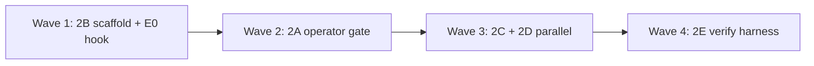

# FIX_2 Wave Campaign — Target/Site Selection & Objective Surface

---

## Campaign identity

| Field | Value |
|-------|-------|
| **Charter** | `Agentic_campaign/FIX_2.md` |
| **Gaps** | P1-003, P5-001, RG-B001, RG-E001 (P1-008 advisory only) |
| **Agents** | 2A–2E (five lanes; up to 10 prompt files if split later) |
| **Exit gate** | `cd daedalus && python verification/run_all_daedalus_verifications.py` → exit 0 |
| **Live acceptance** | `run_all_generated_campaigns.py --target simple_rsi_strategy` proposes `signal_model.py` or `backtest_pnl.py`; no quarantine aux ACCEPT until policy satisfied |

---

## Shared persona (all agents)

You are an **advanced systems engineer** specializing in evolutionary program search, quant RSI pipelines, and fault isolation in multi-epoch orchestrators. You diagnose misaligned optimization surfaces — when search optimizes pytest pass-fraction instead of trading KPIs — and wire hard enforcement, not advisory comments. You ship falsifiable verification, not narrative closure. You respect Daedalus invariants: **Agent proposes, Python disposes**; gating monopoly unchanged; no stubs on canonical targets.

---

## Wave topology (max parallelism with safe merge order)

FIX_2 touches overlapping spine files. **Exclusive write** per agent; merge conflicts resolved by wave order below.



| Wave | Agents | Parallelism | Blocking reason |
|------|--------|-------------|-----------------|
| **1** | **2B** only | 1 | Adds `backtest_pnl.py`; unblocks E0 performance sites, `backtest_hook=` in summaries, R02/R05 trading scalar |
| **2** | **2A** only | 1 | Hard NEW_FILE gate in `proposal_engine.py` + `operator_sampler.py`; must not race 2C on same file |
| **3** | **2C** ∥ **2D** | **2 parallel** | 2C refactors `_resolve_site`; 2D owns mutator/objective prompts — disjoint files |
| **4** | **2E** only | 1 | Integration verifiers + fixtures; consumes A–D outputs |

**Recommended merge order (PR stack):** `2B → 2A → 2C → 2D → 2E`

---

## Agent roster

| ID | Prompt file | Charter segment | Primary deliverable |
|----|-------------|-----------------|---------------------|
| **2A** | `AGENT_2A_SCAFFOLD_OPERATOR_GATE.md` | FIX_2-A | Hard block `NEW_FILE` without strategy core; envelope-driven operator policy |
| **2B** | `AGENT_2B_E0_PERFORMANCE_SCAFFOLD.md` | FIX_2-B | `generated/.../backtest_pnl.py` + R02/R05 performance hook |
| **2C** | `AGENT_2C_SITE_WEIGHT_POLICY.md` | FIX_2-C | `site_weight_policy.py`; curriculum test-cluster cap |
| **2D** | `AGENT_2D_OBJECTIVE_MUTATOR_PROMPTS.md` | FIX_2-D | `objective_summary` + RSI mutator/NEW_FILE prompts |
| **2E** | `AGENT_2E_VERIFY_HARNESS.md` | FIX_2-E | Fixtures + `verify_objective_surface.py` + site distribution tests |

---

## Cross-lane dependencies

| Partner | Handshake |
|---------|-----------|
| **FIX_1** | Bootstrap reward normalization must land first so performance deltas are comparable; 2A/2C do not touch parent pool |
| **FIX_3** | 2D owns `objective_summary` text; FIX_3 must not strip `backtest_hook` from mutation manifest |
| **FIX_4** | 2B writes canonical target scaffold; FIX_4 graduates winning branches |
| **Gating (Wave 4)** | 2B provides `backtest_pnl.verify()`; do **not** wire R22c full eval — gating team owns MetricBundle |

---

## Shared reading list (all agents — skim, then go deep per agent prompt)

### Daedalus spine (required)

- `Agentic_campaign/FIX_2.md` — full charter
- `daedalus/MISSING.JSON` — P1-003, P5-001
- `daedalus/RUN_GAPS.JSON` — RG-B001, RG-E001 live evidence
- `06_DAEDALUS_RSI_Architecture (7).md` — E0→E3 spine
- `PLAN.JSON` — program-database search direction

### Institutional RSI / evolution references

| Reference | Why |
|-----------|-----|
| **AlphaEvolve** (arXiv:2506.13131) | §2.1 `evaluate()` outside mutant; §2.4 eval cascade; problem description in prompt |
| **QuantEvolve** (arXiv:2510.18569) | §4 feature map / behavioral descriptors (P1-008 advisory) |
| **DGM** (arXiv:2505.22954) | Reward from environment; archive must reflect trading improvement |
| **Voyager** (Wang et al.) | Curriculum / skill library — cluster boost alignment |

### OSS sanity checks (non-normative)

- [OpenEvolve](https://github.com/codelion/openevolve) — stage1/stage2 evaluate split
- [jennyzzt/dgm](https://github.com/jennyzzt/dgm) — parent/reward patterns (do not copy gate monopoly)

---

## Campaign exit criteria (all waves complete)

- [ ] `generated/simple_rsi_strategy/backtest_pnl.py` exists; offline pytest passes
- [ ] E0 diagnostics show finite `performance_baseline`
- [ ] `NEW_FILE` blocked when target lacks `_RSI_CORE_FILES`
- [ ] Site weights codified in `site_weight_policy.py`; test clusters not curriculum-boosted
- [ ] Mutator prompts name `backtest_pnl.py`; `objective_summary` includes `backtest_hook=`
- [ ] `run_all_daedalus_verifications.py` exit 0 including new verifiers from B/C/E
- [ ] Live campaign: majority `site_cluster` on `signal_model.py` or `backtest_pnl.py`; no aux quarantine ACCEPT in first 3 rounds

---

## Spin-up instructions

1. Read `FIX_2.md` and this file.
2. Launch **one agent per wave slot**; do not start 2A until 2B merged (or branched from 2B).
3. Each agent runs verification after every meaningful commit:
   ```bash
   cd daedalus
   python verification/run_all_daedalus_verifications.py
   ```
4. Append live evidence to `daedalus/RUN_GAPS.JSON` if campaign behavior changes.
5. Do **not** modify gating E4 cascade or FIX_1 parent sampler unless charter explicitly allows.

---

*FIX_2 wave campaign v1.0.0 — pairs with Fix_2_prompts/AGENT_2*.md*
