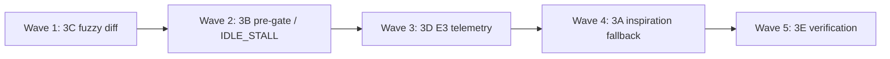

# FIX_3 Wave Campaign — Mutation Context, Diff Apply & Mutator Throughput

---

## Campaign identity

| Field | Value |
|-------|-------|
| **Charter** | `Agentic_campaign/FIX_3.md` |
| **Gaps** | P2-001, P2-002, P2-003, RG-A001, RG-C003 (RG-A002 partial via 3D) |
| **Agents** | 3A–3E (five lanes; up to 10 prompt files if split later) |
| **Exit gate** | `cd daedalus && python verification/run_all_daedalus_verifications.py` → exit 0 |
| **Secondary gate** | `python verification/verify_mutator_context.py` → exit 0 |
| **Live acceptance** | REFACTOR E3 < 250s; `inspiration_count >= 1` after first ACCEPT; `e3_timings` in journal |

---

## Shared persona (all agents)

You are an **advanced systems engineer** specializing in LLM-driven evolutionary loops, diff application pipelines, and live orchestrator throughput. You hunt IDLE_STALLs, empty prompt manifests, and redundant Cursor spawns. You wire AlphaEvolve-style prompt conditioning without relaxing the measurement-monopoly gate (R18–R26, R29, R51, R34). **Agent proposes, Python disposes** — mutators never self-grade.

---

## Wave topology (max parallelism with safe merge order)

Charter recommended implementation order: **C → B → D → A → E** (fuzzy apply reduces rewrite spawns that B relies on).



| Wave | Agents | Parallelism | Blocking reason |
|------|--------|-------------|-----------------|
| **1** | **3C** only | 1 | Fuzzy `diff_apply` — independent; reduces E8 rewrite spawns before 3B |
| **2** | **3B** only | 1 | `mutator.py` + `pre_gate_review.py` — throughput / IDLE_STALL fix |
| **3** | **3D** only | 1 | `e3_e4_verify.py` timing merge + stdout contract |
| **4** | **3A** only | 1 | `prompt_sampler` + `program_database`; shares `e3_e4_verify` log line with 3D — merge after 3D |
| **5** | **3E** only | 1 | Integration verifiers; consumes A–D |

**PR merge stack:** `3C → 3B → 3D → 3A → 3E`

### Optional early parallel (advanced)

| Pair | Safe? | Notes |
|------|-------|-------|
| **3C ∥ FIX_2-D** | Yes | Disjoint files (`diff_apply` vs `mutator_prompt`) |
| **3A A-1/A-2 ∥ FIX_1** | **Careful** | Both may touch `program_database.py` — coordinate file ownership |
| **3B ∥ 3A** | Partial | Disjoint until 3A hits `e3_e4_verify` (Wave 4) |

---

## Agent roster

| ID | Prompt file | Charter segment | Primary deliverable |
|----|-------------|-----------------|---------------------|
| **3A** | `AGENT_3A_INSPIRATION_FALLBACK.md` | Segment A | Young-archive inspiration guarantee + `section_nonempty` manifest |
| **3B** | `AGENT_3B_REFACTOR_IDLE_STALL.md` | Segment B | Kill REFACTOR double-spawn; `DAEDALUS_SKIP_PREGATE_ON_WORK` |
| **3C** | `AGENT_3C_FUZZY_DIFF_APPLY.md` | Segment C | Fuzzy SEARCH/REPLACE + unified hunk matching |
| **3D** | `AGENT_3D_E3_TELEMETRY.md` | Segment D | `e3_timings` journal + `E3_breakdown` stdout |
| **3E** | `AGENT_3E_VERIFY_INTEGRATION.md` | Segment E | Extend `verify_mutator_context.py` + smoke script |

---

## Cross-lane dependencies

| Partner | Handshake |
|---------|-----------|
| **FIX_1** | Full `lineage_ids` + archive inspirations need bootstrap parent normalization (RG-B003); 3A ships partial value via `last_accept` fallback |
| **FIX_2** | `objective_summary` + EVOLVE-BLOCK must name RSI/backtest so inspirations condition meaningful edits — do not strip manifest fields |
| **FIX_4 / Gating** | RG-A002 E4 cascade silence is out of scope; 3D only covers E3 sub-stage visibility |
| **Gating team** | No change to R26/R29/R51/R34 promotion authority |

---

## Shared reading list (all agents)

### Daedalus spine (required)

- `Agentic_campaign/FIX_3.md` — full charter
- `daedalus/MISSING.JSON` — `phase_2_mutation_context_apply`
- `daedalus/RUN_GAPS.JSON` — RG-A001, RG-C003, `run_gaps_simple_rsi_002`
- `06_DAEDALUS_RSI_Architecture (7).md` — E3 mutator chamber
- `daedalus/GATING+METRICS_Plan.md` — throughput targets (~12 candidates/hour)

### Institutional references

| Reference | FIX_3 mapping |
|-----------|---------------|
| **AlphaEvolve** (arXiv:2506.13131) | §2.2 prompt sampling; §2.3 SEARCH/REPLACE; §2.6 async throughput |
| **DGM** (arXiv:2505.22954) | Parent diff + archive conditioning |
| **QuantEvolve** (arXiv:2510.18569) | Mutation must affect tradable code paths |
| **Gödel Machine** (Schmidhuber) | Self-improvement requires explicit utility in context — `prompt_manifest` truth |

### OSS sanity checks (non-normative)

- [OpenEvolve](https://github.com/codelion/openevolve) — evaluate / prompt / diff patterns
- [jennyzzt/dgm](https://github.com/jennyzzt/dgm) — parent archive conditioning

---

## Live evidence (must understand)

From `run_gaps_simple_rsi_002`:

- **RG-C003:** `prompt_manifest: inspiration_ids=[], lesson_count=0` on accepts despite P2 wiring
- **RG-A001:** REFACTOR 403–494s; `flash ~95s` → `spawn:claude` 180s IDLE_STALL → retry ~99–118s
- **RG-B003 (FIX_1):** Parent reverts to `cold_start::baseline_champion` at `pop=2`

---

## Campaign exit criteria

- [ ] After first ACCEPT, E3 prompts include ≥1 inspiration with non-empty `diff_excerpt`
- [ ] REFACTOR round: `pre_gate_spawns == 0` when compile clean (env default)
- [ ] `e3_timings.rewrite_spawn_ms == 0` when `work_hits > 0`
- [ ] 10/10 golden fuzzy SEARCH/REPLACE cases apply without rewrite fallback
- [ ] Every E3 round emits `E3_breakdown` when `DAEDALUS_STAGE_HEARTBEAT=1`
- [ ] `run_all_daedalus_verifications.py` + `verify_mutator_context.py` exit 0
- [ ] Live REFACTOR < 250s; journal `inspiration_ids` non-empty on round 2+

---

## Spin-up instructions

1. Read `FIX_3.md` and this file.
2. Respect wave order — do not start 3B before 3C merged if rewrite path depends on fuzzy apply.
3. After each commit:
   ```bash
   cd daedalus
   python verification/run_all_daedalus_verifications.py
   python verification/verify_mutator_context.py
   ```
4. Mark `RG-A001`, `RG-C003` as `mitigated_fix_3` in `RUN_GAPS.JSON` with log excerpt after live validation.
5. Do not expand gate authority or bypass R18/R26 verification.

---

*FIX_3 wave campaign v1.0.0 — pairs with Fix_3_prompts/AGENT_3*.md*
