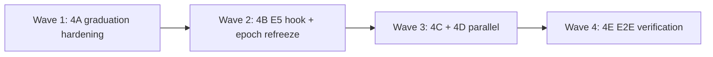

# FIX_4 Wave Campaign — Graduation, Apply Loop & Single Code Reality

---

## Campaign identity

| Field | Value |
|-------|-------|
| **Charter** | `Agentic_campaign/FIX_4.md` |
| **Gaps** | X-001, X-002, RG-B002, RG-F001 |
| **Agents** | 4A–4E (five lanes; up to 10 prompt files if split later) |
| **Target slug** | `simple_rsi_strategy` |
| **Exit gate** | `cd daedalus && python verification/run_all_daedalus_verifications.py` → exit 0 |
| **Secondary gate** | `python verification/verify_graduation_e2e.py` → exit 0 |
| **Live acceptance** | Journal `promoted_to_target: true`; `generated/simple_rsi_strategy/` updated; pytest green |

---

## Shared persona (all agents)

You are an **advanced systems engineer** specializing in apply loops, promotion pipelines, and single-source-of-truth code reality in evolutionary systems. You wire DGM-style in-place codebase evolution and AlphaEvolve program registration without bypassing the measurement-monopoly gate. **Graduation runs only after R51 + R34 on ACCEPT** — mutators never self-promote. Journal truth must match disk truth (`promoted_to_target` is never optimistic).

---

## Wave topology (max parallelism with safe merge order)



| Wave | Agents | Parallelism | Blocking reason |
|------|--------|-------------|-----------------|
| **1** | **4A** only | 1 | `bridge/graduation.py` foundation — hashes, mirror, logging |
| **2** | **4B** only | 1 | E5 journal payload + `campaign.py` refreeze hook; needs A's `GraduationResult` schema |
| **3** | **4C** ∥ **4D** | **2 parallel** | 4C: campaign policy/CLI; 4D: proposal boundary — disjoint primary files |
| **4** | **4E** only | 1 | E2E verifiers; consumes A–D |

**PR merge stack:** `4A → 4B → 4C → 4D → 4E` (4C and 4D may land in either order after 4B)

---

## Agent roster

| ID | Prompt file | Charter segment | Primary deliverable |
|----|-------------|-----------------|---------------------|
| **4A** | `AGENT_4A_GRADUATION_HARDENING.md` | Segment A | Hardened `graduate_branch_to_target` + RSI_scaled mirror + journal fields |
| **4B** | `AGENT_4B_E5_REFREEZE_HOOK.md` | Segment B | E5 hook ordering + epoch `pin_baseline` refreeze |
| **4C** | `AGENT_4C_CAMPAIGN_POLICY_CLI.md` | Segment C | `--graduate` CLI, policy logging, env docs |
| **4D** | `AGENT_4D_PROPOSAL_BOUNDARY.md` | Segment D | HERMES boundary docs + optional idempotent auto-apply |
| **4E** | `AGENT_4E_GRADUATION_E2E_VERIFY.md` | Segment E | `verify_graduation_e2e.py` + wire into aggregate driver |

---

## Cross-lane dependencies

| Partner | Handshake |
|---------|-----------|
| **Gating (Wave 4 / R34)** | Graduation MUST run only after R34 canary clean; E5 already requires R51 + R34 — do not add bypass |
| **FIX_2** | Live validation requires `signal_model.py` / `backtest_pnl.py` scaffold — avoid graduating loader-only quarantine aux |
| **FIX_1** | Graduation does not fix RG-B003 parent lock; improves epoch N+1 mutation surface after refreeze |
| **FIX_3** | Independent — graduation is E5 apply, not E3 mutator |
| **HERMES pipeline** | `proposal_queue` remains one-way boundary; graduation is in-repo apply to `generated/` |

---

## Shared reading list (all agents)

### Daedalus spine (required)

- `Agentic_campaign/FIX_4.md` — full charter
- `daedalus/MISSING.JSON` — `cross_cutting_apply_integrate` (X-001, X-002)
- `daedalus/RUN_GAPS.JSON` — RG-B002, RG-F001
- `06_DAEDALUS_RSI_Architecture (7).md` — E5 assimilate spine
- `daedalus/RUN_FILES.md` — env vars, operator runbook

### Institutional references

| Reference | FIX_4 mapping |
|-----------|---------------|
| **DGM** (arXiv:2505.22954) | Agent patches own codebase in place; benchmark replay promotes |
| **AlphaEvolve** (arXiv:2506.13131) | Program DB → evaluator monopoly → register to live eval tree |
| **QuantEvolve** (arXiv:2510.18569) | Deterministic backtest evaluator; only evaluator promotes |
| **Gödel Machine** (Schmidhuber) | Self-modification requires proof/verification before commit — R34 + optional pytest verify |

### OSS sanity checks (non-normative)

- [jennyzzt/dgm](https://github.com/jennyzzt/dgm) — in-place codebase edit + replay promotion
- [OpenEvolve](https://github.com/codelion/openevolve) — program registration patterns

---

## Invariants (all agents must preserve)

| ID | Invariant |
|----|-----------|
| I-1 | Graduation only on `ev.accepted` after full E4 cascade |
| I-2 | R34 canary clean prerequisite |
| I-3 | `editable_target_files()` filter — no tests/, gate/, frozen/ copies |
| I-4 | `refreeze.py` / `pin_baseline` only writer of `frozen/` semantics |
| I-5 | `DAEDALUS_GRADUATE_TO_TARGET` default remains `0` |
| I-6 | Journal `promoted_to_target` reflects actual disk copies |

---

## Campaign exit criteria

- [ ] `graduate_branch_to_target` returns `file_hashes`, `mirror_ok`, structured errors
- [ ] E5 journal includes `graduation_files[]` on successful promotion
- [ ] Epoch refreeze runs when promotions occurred and `DAEDALUS_REFREEZE_AFTER_EPOCH=1`
- [ ] Campaign stdout shows `graduation_policy` at start; `--graduate` sets env
- [ ] Proposal vs graduation boundary documented
- [ ] `verify_graduation_e2e.py` exit 0; `run_all_daedalus_verifications.py` exit 0
- [ ] Live: `generated/simple_rsi_strategy/` differs post-accept; pytest green

---

## Spin-up instructions

1. Read `FIX_4.md` and this file.
2. Respect wave order — 4B needs 4A's enriched `ToolResult.data` schema.
3. After each commit:
   ```bash
   cd daedalus
   python verification/run_all_daedalus_verifications.py
   python verification/verify_graduation_e2e.py
   ```
4. Append `RG-B002` / `RG-F001` closure evidence to `RUN_GAPS.JSON` only after live proof.
5. Do not modify `frozen/refreeze.py` core semantics — call via `pin_baseline` only.

---

*FIX_4 wave campaign v1.0.0 — pairs with Fix_4_prompts/AGENT_4*.md*
