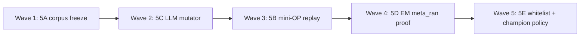

# FIX_5 Wave Campaign — Meta-RSI Searcher Self-Improvement

---

## Campaign identity

| Field | Value |
|-------|-------|
| **Charter** | `Agentic_campaign/FIX_5.md` |
| **Gaps** | P4-001 … P4-009, RG-D001 … RG-D005, P4-T001 … P4-T003 |
| **Owner** | `D_meta_rsi` (`RUN_GAPS.JSON` → `agent_assignments.D_meta_rsi`) |
| **Agents** | 5A–5E (five lanes; up to 10 prompt files if split later) |
| **Exit gate** | `cd daedalus && python verification/verify_meta_mutation.py` → exit 0 |
| **Aggregate gate** | `python verification/run_all_daedalus_verifications.py` → exit 0 |
| **Live acceptance** | `meta_ran=true`; `frozen_corpus_size >= 8`; `patch_source=llm_log_conditioned`; `n_rounds > 0` |

---

## Shared persona (all agents)

You are an **advanced systems engineer** specializing in RSI-on-RSI — evolutionary improvement of the search/mutation stack itself, not the target strategy tree. You implement DGM §C.3 log-conditioned self-patches, ADAS meta-agent search, and AlphaEvolve meta-prompt co-evolution without weakening the measurement monopoly. **Meta mutators propose; mini-OP replay + safety stack dispose.** Agent proposes, Python disposes — same principle as gating AGENT_D.

---

## Wave topology (max parallelism with safe merge order)

Charter recommended sequence: **A → C → B → D → E**.



| Wave | Agents | Parallelism | Blocking reason |
|------|--------|-------------|-----------------|
| **1** | **5A** (+ optional **5C** ∥) | 1–2 | Hash-locked frozen corpus ≥8 tasks — foundation for replay |
| **2** | **5C** only | 1 | If 5C not started in W1; LLM meta mutator path |
| **3** | **5B** only | 1 | `mini_op_replay` needs frozen corpus from 5A |
| **4** | **5D** only | 1 | EM scheduling + `meta_ran=true` — needs A+B+C |
| **5** | **5E** only | 1 | Whitelist phases + wire/prune champion policy fields |

**PR merge stack:** `5A → 5C → 5B → 5D → 5E`

### Optional early parallel (advanced)

| Pair | Safe? | Notes |
|------|-------|-------|
| **5A ∥ 5C** | Yes | `historical_corpus.py` vs `meta_mutator_llm.py` — disjoint |
| **5E ∥ 5D** | Partial | Both may touch `campaign.py` / `champion_apply.py` — prefer sequential |

---

## Agent roster

| ID | Prompt file | Charter segment | Primary deliverable |
|----|-------------|-----------------|---------------------|
| **5A** | `AGENT_5A_FROZEN_CORPUS.md` | Segment A | E5 journal freeze ≥8 diverse tasks (P4-004) |
| **5B** | `AGENT_5B_MINI_OP_REPLAY.md` | Segment B | Honest propose→mutate replay rounds (P4-003) |
| **5C** | `AGENT_5C_META_MUTATOR_LLM.md` | Segment C | LLM-default meta mutator + offline fallback (P4-002, P4-007) |
| **5D** | `AGENT_5D_EM_SCHEDULING.md` | Segment D | EM epoch execution + `meta_ran=true` proof (P4-001) |
| **5E** | `AGENT_5E_WHITELIST_CHAMPION.md` | Segment E | Phased whitelist + champion policy wiring (P4-006, P4-T001) |

---

## Cross-lane dependencies

| Partner | Handshake |
|---------|-----------|
| **FIX_1–4** | ≥8 diverse OP ACCEPT journal records before EM; real rewards, sites, parents |
| **Gating AGENT_D** | Meta promotion respects gate profiles; measurement monopoly unchanged |
| **FIX_2** | Signal/backtest scaffold — loader-only accepts pollute corpus |
| **P4-008/009** | Engine self-edit + meta-prompt co-evolution deferred until live proof |

---

## Shared reading list (all agents)

### Daedalus spine (required)

- `Agentic_campaign/FIX_5.md` — full charter
- `daedalus/MISSING.JSON` — `phase_4_meta_rsi`
- `daedalus/RUN_GAPS.JSON` — RG-D001–D005, `run_gaps_simple_rsi_002`
- `06_DAEDALUS_RSI_Architecture (7).md` — EM epoch map
- `daedalus/GATING+METRICS_Plan.md` — agent proposes, Python disposes
- `daedalus/agent_prompts/gating/AGENT_D_META_RSI.md` — G6-meta gate policy

### Institutional references

| Reference | FIX_5 mapping |
|-----------|---------------|
| **DGM** (arXiv:2505.22954 §C.3) | Log analyze → LLM patch → benchmark replay → archive |
| **ADAS** (arXiv:2408.08435) | Meta-agent programs agents in executable code |
| **AlphaEvolve** (arXiv:2506.13131) | Meta-prompt DB co-evolution; evaluator monopoly |
| **QuantEvolve** (arXiv:2510.18569) | Held-out replay discrimination |
| **Gödel Machine** (Schmidhuber) | Self-modification only after verified improvement |

### OSS sanity checks (non-normative)

- [jennyzzt/dgm](https://github.com/jennyzzt/dgm) — self-improving coding agent patterns
- [OpenEvolve](https://github.com/codelion/openevolve) — program DB + meta-evolution

---

## Live evidence (must understand)

From `run_gaps_simple_rsi_002`:

- `meta_ran=false` — campaign aborted before epoch index 2
- `frozen_corpus_tasks=2` — bootstrap padding, not campaign journal
- `source=deterministic_log_conditioned` — no LLM patches in pre-fix runs
- `n_rounds=0`, `compile_ok=false` — mini-OP could not discriminate

---

## Safety stack (all agents must preserve)

| Gate | Purpose |
|------|---------|
| MetaSafety boundary | Whitelist-only; deny gate/metric/frozen |
| R33 AST | No whitelist widening |
| M006 compile | Patched searcher imports |
| R51 ShadowAB | Counterfactual vs champion replay |
| R31 MetaBenchmark | Meta score non-regression |
| R52 budget | `META_REPLAY_BUDGET_TOKENS` wall |

**Never whitelist:** `gate/`, `metric/`, `frozen/`, `governance/`, R29/R30/R33 modules.

---

## Campaign exit criteria (Definition of Done)

- [ ] `verify_meta_mutation.py` + `run_all_daedalus_verifications.py` exit 0
- [ ] Live campaign completes EM at epoch index ≥2
- [ ] `meta_ran=true` in campaign summary / RUN_GAPS
- [ ] `frozen_corpus_size >= 8` from real journal (not bootstrap-only)
- [ ] `patch_source=llm_log_conditioned` at least once
- [ ] `replay.candidate.n_rounds > 0`
- [ ] Champion policy applied to next OP epoch (`exploration_c`, `parent_temperature` logged)
- [ ] RG-D001–D005 marked resolved with live evidence

---

## Spin-up instructions

1. Read `FIX_5.md` and this file.
2. **Precondition:** FIX_1–4 merged and live journal has ≥8 diverse ACCEPTs.
3. After each commit:
   ```bash
   cd daedalus
   python verification/verify_meta_mutation.py
   python verification/run_all_daedalus_verifications.py
   ```
4. Live meta run:
   ```bash
   export HERMES_CURSOR_EXECUTION=wsl_native
   export DAEDALUS_META_MODE=agent_search
   export DAEDALUS_META_OFFLINE=0
   export DAEDALUS_META_APPLY_PATCH=0
   python verification/live/run_all_generated_campaigns.py --target simple_rsi_strategy
   ```
5. Do not enable `META_ALLOW_ENGINE_SELF_EDIT` or `DAEDALUS_META_APPLY_PATCH=1` without operator signoff.

---

*FIX_5 wave campaign v1.0.0 — pairs with Fix_5_prompts/AGENT_5*.md*
